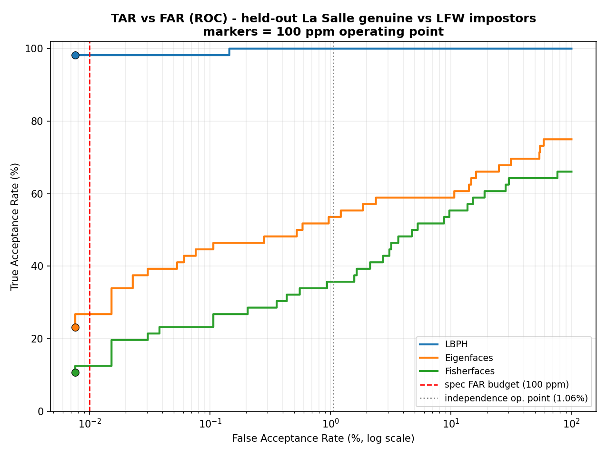
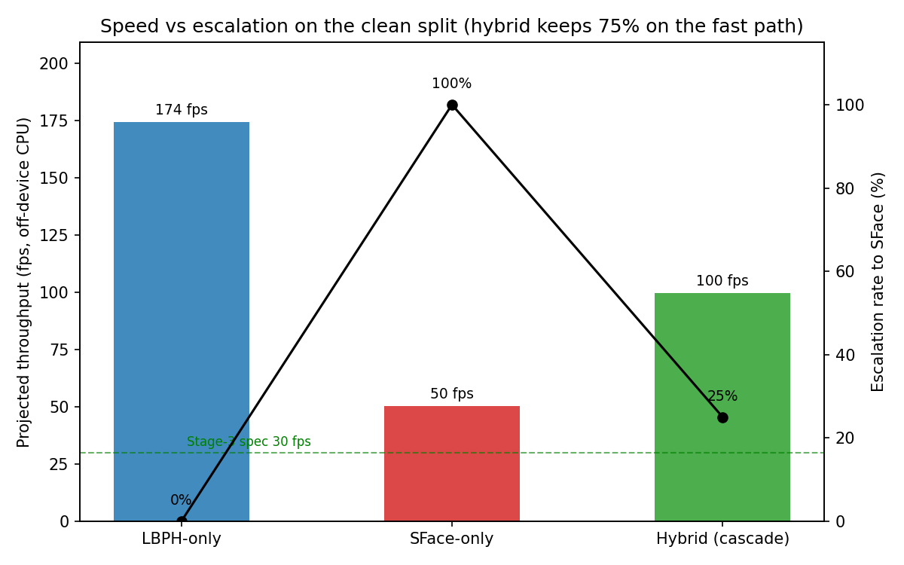

# Facial Recognition Using Hybrid Technologies Based on Independence Testing

[Author names], Group 3
[College], University of St. La Salle, Bacolod City, Philippines
[email]

> **Length target:** 6 pages max, IEEE two-column (body ~3,600 words + 4 figures + 6 tables). Every number is from a committed run; sources and dates are indexed in `docs/audits/STATE-07-10.md`. If typesetting runs long, trim in this order: §4.1 threshold detail, §2, the §4.7 discussion. Never trim the confidence intervals or the transfer results.

---

**Abstract.** A camera-based smart gate must recognize enrolled people accurately, respond in real time, and run on cheap edge hardware. No single method does all three. Classical computer-vision (CV) recognizers such as LBPH are small and fast, but they break under poor lighting, blur, and noise. Deep-learning (DL) recognizers such as SFace stay accurate under those conditions, but they cost far more compute per frame. LS-Face is a gated cascade. It runs LBPH on every frame and sends only the hard frames to SFace. Every threshold comes from independence testing: we compare every image to every other image (N×(N−1) pairs), where each pair is an impostor by construction, and read the threshold off the impostor distance distribution at a target false-acceptance rate (FAR). On a leakage-free La Salle split, LBPH with Tan-Triggs normalization reaches 98.21% true acceptance at 76 ppm FAR against 13,149 LFW impostors. SFace passes the same protocol on LFW (false accepts 0.0747% over 32.3 million comparisons). On a shared 41-modification robustness suite, SFace wins 9 of 12 modification families and correctly identifies 78.6% of the probes LBPH gets wrong. The cascade stays within 2 points of the better engine on all 12 families while escalating only 25% of clean frames, which doubles SFace-only throughput. The joint impostor sweep gives a clear result: the two engines' false accepts are positively correlated, because a pair that is hard for one is hard for the other (Fisher p below 10^-51 over 33 million LFW pairs). Even so, the cascade cuts the combined false-accept rate to 98 ppm, below LBPH-only (867 ppm) and SFace-only (190 ppm). The two engines complement each other in accuracy and cost, not in error independence, and we report both sides.

**Keywords.** face recognition, independence testing, threshold determination, hybrid method, classical computer vision, edge deployment

## 1. Introduction

Automated gates need a recognizer that (a) admits enrolled users reliably, (b) rejects strangers with very high confidence, (c) answers in a fraction of a second, and (d) runs on low-cost hardware such as a Raspberry Pi 5.

Two method families each satisfy only part of this list. Classical CV recognizers (Eigenfaces [1], Fisherfaces [2], LBPH [3]) are tiny, train in seconds, and predict in under a millisecond on a CPU, but their accuracy collapses under illumination change, pose, blur, and noise. Lightweight DL recognizers such as SFace [4] stay accurate under those corruptions but cost several times more per frame. Our claim is that this is not a tie to be broken but a complementarity to be exploited: a hybrid that routes each frame to the cheapest engine that can be trusted with it gets close to the best of both.

A second problem is setting the match threshold. Verification reduces to "accept if the feature distance is below θ," and picking θ is easy only when many labeled genuine and impostor pairs exist [9]. Real enrollment has a small gallery and no negative pairs at all. LS-Face solves this with **independence testing**: build a database with exactly one image per identity, compare every image to every other one (N×(N−1) ordered comparisons, all impostor pairs by construction), and read θ off that empirical impostor distribution at the target FAR. The same sweep doubles as a health check: it exposes recognizers whose impostor distances collapse and near-zero pairs that flag annotation errors.

This paper contributes: (1) a common benchmark of three classical recognizers against a lightweight DL recognizer under one preprocessing, evaluation, and reporting framework, with detection migrated from Viola-Jones [5] to YuNet [7] on a measured head-to-head; (2) an independence-testing protocol that derives thresholds at specified FARs on La Salle and LFW [8]; (3) a joint independence test that scores both engines and the fused cascade on the same impostor pairs, quantified with the standard diversity measures [11], exact tests, and confidence intervals; (4) a 41-modification robustness suite applied to CV, DL, and the hybrid, with a paired per-probe analysis (recovery rate, McNemar [12]) of which corruption each family survives; and (5) a gated cascade that converts the measured strengths into a deployable system.

Section 2 reviews related work, Section 3 the method, Section 4 the results; Section 5 concludes.

## 2. Related Work

**Classical recognition.** Eigenfaces [1] projects faces onto PCA components; Fisherfaces [2] adds LDA to separate classes; LBPH [3] compares local binary-pattern histograms per region. All three ship in OpenCV [10], need no GPU, and produce models from kilobytes to a few megabytes.

**Deep recognition.** FaceNet [6] mapped faces to an embedding space with triplet loss. SFace [4] uses a sigmoid-constrained hypersphere loss and is small enough to run on edge hardware, so we use it as the hybrid's DL engine.

**Detection.** Viola-Jones Haar cascades [5] remain the classical baseline; YuNet [7] is a millisecond-scale CNN detector that also returns the five landmarks DL recognizers use for alignment.

**Evaluation.** Biometric practice separates TAR, FAR, and FRR [9]. LFW [8] tests verification on fixed pair lists; independence testing instead yields the whole impostor distribution, so a threshold ties to an exact error count. For claims that two recognizers complement each other we adopt the standard yardsticks rather than invent our own: pairwise diversity measures (Yule's Q, double-fault [11]) and McNemar's paired test [12].

## 3. Method

### 3.1 System overview

LS-Face processes one camera frame as follows. A shared YuNet front-end returns one face box, a confidence, and five landmarks. The frame first takes the cheap path: LBPH (grayscale 100×100 crop, Tan-Triggs illumination normalization) predicts an identity and a distance d. A **gate** then decides whether that answer can be trusted. If yes, LBPH's decision stands and the DL model never runs. If not, the frame **escalates**: SFace aligns the face to 112×112 with the landmarks, extracts a 128-D (512-byte) embedding, and matches it against per-identity mean embeddings by cosine similarity. A no-accelerator fallback (LBPH alone) engages automatically if the DL gallery is absent.

### 3.2 Independence testing and threshold rule

Take N identities with one image each. Comparing every image against every other gives

  C = N × (N − 1)  ordered comparisons, (1)

all impostor pairs by construction. Sort the C distances ascending. To operate at a target rate FAR*, choose the rank

  k = ⌈ FAR* · C ⌉, (2)

and set θ to the k-th smallest impostor distance: exactly k impostor pairs fall inside θ, so the realized FAR is k/C. On La Salle DB1 (N=28, C=756) the design point is the 8th error pair, FAR = 8/756 ≈ 1.06%; 756 comparisons cannot resolve finer than ~1,300 ppm, so the 100 ppm spec budget is certified on LFW DB1 (N=5,749, C=33,045,252; the 331st pair ≈ 10 ppm). The full formalism is in `docs/archive/report_docs/independence_test/MATHEMATICAL_FOUNDATION.md` in the repository.

### 3.3 The escalation gate

Let d₁ and d₂ be the best and second-best LBPH distances, and let τ_a < τ_r be the accept and reject thresholds from independence testing. The gate escalates a frame to SFace if **any** of:

  (i) a quality flag fires (blur, low light, sensor noise, off-pose, or too-small face, measured on the crop LBPH already holds);
  (ii) the score is ambiguous: τ_a < d₁ < τ_r;
  (iii) the top-two margin is thin: (d₂ − d₁)/d₁ < m_min. (3)

The margin is relative because LBPH training distances are near zero by memorization; an absolute margin fitted on training data escalates every held-out frame. A quality flag deliberately overrides a confident LBPH score: the corrupted regimes are exactly where LBPH confidence is least trustworthy. If nothing fires, d₁ ≤ τ_a accepts on LBPH and d₁ ≥ τ_r rejects.

### 3.4 Robustness: the 41-modification accuracy ratio

Every original image receives 41 deterministic (modification, level) variants across 12 types: brightness up/down, contrast up/down, gamma up/down, Gaussian noise, Gaussian blur, motion blur, rotation, zoom, occlusion. A modified probe matches when the recognizer outputs the correct identity within the deployed threshold. With M probes and K matches,

  AR = K / M, (4)

averaged per modification over its levels, then over modifications. The suite is seeded per (image, modification, level), so CV, DL, and hybrid score bit-identical probes.

### 3.5 Testing complementarity directly

Complementarity is three claims, each with its own instrument.

**Robustness: does DL survive what breaks CV?** Per modification, compare AR_CV with AR_DL; the cascade should track the better of the two. Because all engines score identical probes, the per-probe outcomes form a paired 2×2 table (both right, only LBPH right, only SFace right, both wrong) giving three direct statistics: the **recovery rate** P(SFace correct | LBPH wrong); the **both-wrong rate**, the accuracy ceiling no fusion of the two can beat; and **McNemar's exact test** [12] on the discordant cells, certifying the gap is not sampling noise.

**Gate competence: can the cascade route?** Escalation helps only if LBPH's own signal predicts LBPH's failures. We score the gate signal (distance d₁ and relative margin) against the label "LBPH got this probe wrong" and report ROC AUC; 0.5 would mean escalation is blind.

**Error independence on impostors.** On the same sweep, flag each pair a CV false accept (d ≤ τ_a) and/or a DL false accept (cosine ≥ 0.363 and L2 ≤ 1.128). Independent errors would give

  E[both] = C · P(FP_CV) · P(FP_DL). (5)

We report observed against expected, Fisher's exact test in both directions, and the literature-standard [11]

  Q = (ad − bc) / (ad + bc),  DF = a / C, (6)

where a = both engines err, b/c = exactly one, d = neither. Two honesty rules govern the reading. First, Q pins to −1 whenever a = 0 regardless of base rates, and at La Salle's error rates a zero cell is the expected outcome under independence, so a lone "Q = −1" is a floor artifact; the base-rate-aware quantities and the cascade's own false-accept count carry the claim. Second, the direction is empirical: a significant excess of joint errors refutes independence, which is exactly what Section 4.5 finds. DF stays useful either way as the impostor-side floor of any fusion. Every rate carries a 95% Wilson interval; 756 comparisons cannot support bare point estimates.

### 3.6 One threshold set, four databases

Good numbers on four separately tuned databases would only show the method is tunable; the generalization claim needs transfer. Every threshold (τ_a, τ_r, m_min, the SFace genuine rule) is derived once on La Salle DB1, frozen (the harness records the file's SHA-256), and applied unchanged everywhere. Enrollment is always clean originals; only probes are modified. Each database answers one question (Table 1):

**Table 1. Evidence matrix (`src/benchmark/evidence_matrix.py`).**

| Database | Test | What it proves |
|---|---|---|
| La Salle DB1 (28 ids, clean) | independence sweep, 10 seeded repeats | in-domain FAR at the frozen thresholds (derived here) |
| La Salle DB2 (41 mods) | accuracy ratio, CV / DL / cascade / parallel | robustness under degradation; per-modification winners |
| LFW DB1 (5,749 ids, clean) | independence sweep | out-of-domain transfer with real statistical power |
| LFW DB2 (41 mods, 1 image/id) | independence sweep on modified probes | degradation and identity separation jointly, out of domain |

The cascade's natural rival is also in the table: a parallel mode that runs both engines on every probe is the accuracy ceiling at full DL cost, and the cascade must stay within tolerance of it while escalating only a fraction of frames; otherwise the gate adds no value.

All identification and verification numbers on LS-DB1/LS-DB2 use **closed-set enrollment**: gallery and probes share the same 28 identities and are image-disjoint (10 gallery / 2 probe images per identity), mirroring a gate that admits only enrolled subjects. Robustness to unseen identities is measured as impostor rejection against the LFW legs; open-set identification is out of scope.

## 4. Experiments and Results

**Databases.** La Salle DB1: 28 people × 12 pre-cropped 100×100 images; leakage-free split of 10 gallery + 2 held-out probe images per identity (280/56); image-disjointness verified. La Salle DB2: the 41-variant suite on the held-out probes (56×41 = 2,296). LFW DB1 [8]: 5,749 people, 13,233 photos (13,149 usable after Haar cropping) as the impostor set. All pipelines share preprocessing and detection settings, except each family uses its measured-best illumination normalization (Tan-Triggs for LBPH; histogram equalization for the subspace methods), single-sourced so training, evaluation, and thresholding cannot drift.

**Detection.** On 336 controlled La Salle photos YuNet detected 100% of faces with zero false positives at 48.6 fps, versus Haar's 86.9% with 43 false positives at 37.2 fps; Haar's misses concentrate on the non-frontal and dark shots a gate must tolerate. On 600 LFW images both saturate recall and YuNet is faster (359 vs 129 fps) with a 4× smaller model that also outputs the landmarks SFace needs. YuNet is the selected detector.

### 4.1 Independence testing per engine

On La Salle DB1 (756 comparisons, 8th error pair = 1.058% FAR) the impostor thresholds are LBPH 21.35 raw (85.88 normalized), Eigenfaces 8,098.46 (71.00), Fisherfaces 5,446.46 (66.38); LBPH keeps impostors farthest apart (Fig. 1). The deployable thresholds on each recognizer's own predict scale at the 100 ppm budget are LBPH 73.0, Eigenfaces 4,308, Fisherfaces 738. Near-zero pairs were investigated rather than assumed: on La Salle they traced to a normalization floor and a one-image LDA collapse, not bad labels; on LFW all three families flagged the same known annotation-error pair (Andrew Caldecott vs Andrew Gilligan). SFace passes the same protocol on LFW: over 5,685 identities and 32,313,540 comparisons, 24,128 impostor pairs fall inside its genuine rule, FP 0.0747%, reproducing the DL track's reference within 0.005 points.

Per-run stability across the 10 seeded La Salle repeats is LBPH 68.03 ± 1.83 on the normalized scale (Eigenfaces 48.20 ± 2.51, Fisherfaces 43.15 ± 4.17), materially below the pooled normalized figures above; the discrepancy is a renormalization artifact documented in the run reports, and the raw-distance and realized-FAR operating points are unaffected.

The full LFW sweep for LBPH has now run end to end (5,749 identities; 33,045,252 comparisons, streaming). At the La Salle design rate (10,000 ppm) the threshold is raw 19.18 at rank 330,453. The 10 ppm anchor (331st pair) lies between the stored rank-256 and rank-512 curve points (raw 17.02 and 17.20); extracting the exact value needs one re-rank pass at scale and is left open. The tail repeats the annotation lesson: rank 8 is the known Caldecott/Gilligan error, and the new global minimum pair (Carlos Beltran vs Raul Ibanez, raw 10.12) awaits the same check. The streaming path is single-pass, so the LFW thresholds carry no repeat-stability estimate yet; we state that rather than hide it.

*Fig. 1. Impostor distance distributions from the La Salle independence sweep (one image per identity, 756 comparisons per family).*

### 4.2 Verification: only LBPH survives the FAR budget

Closed-set rank-1 on the held-out split ranks LBPH 100%, Eigenfaces 75%, Fisherfaces 66.07%. But a gate must also reject strangers, so the deciding metric is TAR at fixed FAR against 13,149 LFW impostors (Table 2). To keep the engine choice mechanical rather than post-hoc, it follows a rule committed before reading the results (applied verbatim by `src/benchmark/compare_classical.py`): eligible = TAR ≥ 90% at the independence operating point, feature < 1 KB, live FPS ≥ 3; among eligible models the highest 41-modification AR wins, ties under 2 points broken by TAR, then model size.

*Fig. 2. TAR/FAR verification curve, classical recognizers against the LFW impostor set (Table 2's operating point is the marked node).*

**Table 2. Classical recognizers, verification vs 13,149 LFW impostors (realized FAR 76 ppm).**

| Recognizer | Rank-1 | TAR @100 ppm (95% CI) | FRR (95% CI) | EER | Overall AR (41 mods) | Feature | Model |
|---|---:|---:|---:|---:|---:|---:|---:|
| LBPH (Tan-Triggs) | 100.00% | **98.21%** [90.6-99.7] | 1.79% [0.3-9.4] | 0.07% | 85.43% | 64 KB | ≈33 MB |
| Eigenfaces | 75.00% | 23.21% [14.1-35.8] | 76.79% [64.2-85.9] | 31.77% | 47.69% | 1,120 B | ≈83 MB |
| Fisherfaces | 66.07% | 10.71% [5.0-21.5] | 89.29% [78.5-95.0] | 35.71% | 30.54% | 108 B | 8.2 MB |

n=56 genuine probes; CIs are 95% Wilson intervals, wide by construction (one probe moves TAR by 1.79 points). Only LBPH passes the spec accuracy block (TAR 90-95%, FAR < 100 ppm, FRR 1-5%); the subspace methods' genuine and impostor distributions overlap intrinsically. Tan-Triggs lifts LBPH from TAR 96.4%/EER 3.6% to the table's numbers while degrading the subspace methods, so there is no single best preprocessing, another argument for per-engine contracts. LBPH's one failing metric is its 64 KB histogram against the sub-1 KB feature budget; the hybrid fixes this by enrolling with SFace's 512-byte embedding.

### 4.3 Robustness: where CV breaks, and how much of it DL recovers

LBPH's 41-modification AR is 85.43% overall but bimodal (Fig. 3): photometric edits it absorbs (occlusion 98.8%, gamma 97.6-98.2%, contrast-down 98.2%), while heavy Gaussian noise (47.8%), motion blur (68.5%), and strong darkening (73.7%) break it. The subspace methods fail geometrically (rotation: 26.3% / 14.3%). These weak spots are exactly the regimes the gate's quality probes watch.

*Fig. 3. Accuracy ratio per modification, classical families. LBPH's failure modes (noise, motion blur, darkening) define the gate's quality probes.*

Table 3 scores the same 2,296 probes with SFace, the cascade, and the run-both parallel ceiling (`src/benchmark/accuracy_ratio_hybrid.py`), plus the paired per-probe statistics of Section 3.5.

**Table 3. The 41-modification suite, all configurations.** AR in %; winner = beyond the 2-point tie band; Escal. = cascade escalation; Recovery = P(SFace correct | LBPH wrong).

| Modification | LBPH | SFace | Cascade | Winner | Escal. | Recovery |
|---|---:|---:|---:|:--|---:|---:|
| brightness_up | 97.8 | 100.0 | 100.0 | DL | 40% | 100% |
| brightness_down | 73.7 | 98.2 | 98.2 | DL | 74% | 93% |
| contrast_up | 85.1 | 100.0 | 98.2 | DL | 53% | 100% |
| contrast_down | 98.2 | 100.0 | 100.0 | tie | 46% | 100% |
| gamma_up | 98.2 | 100.0 | 100.0 | tie | 18% | 100% |
| gamma_down | 97.6 | 100.0 | 100.0 | DL | 73% | 100% |
| gaussian_noise | 47.8 | 59.8 | 59.8 | DL | 92% | 38% |
| gaussian_blur | 88.1 | 100.0 | 100.0 | DL | 100% | 100% |
| motion_blur | 68.5 | 100.0 | 98.8 | DL | 92% | 100% |
| rotation | 83.5 | 100.0 | 99.6 | DL | 74% | 100% |
| zoom | 87.9 | 100.0 | 98.7 | DL | 67% | 100% |
| occlusion | 98.8 | 100.0 | 100.0 | tie | 25% | 100% |
| **Overall** | **85.43** | **96.50** | **96.11** | 9 DL / 0 CV / 3 tie | 63% | **78.6%** |

Pooled with 95% Wilson intervals: LBPH 84.5% [83.0, 86.0], SFace 95.9% [95.0, 96.6], cascade 95.5% [94.6, 96.3]. Mean latency on this suite: LBPH 5.6 ms, SFace 22.4 ms, cascade 16.0 ms, parallel 22.8 ms.

The expected split is now measured rather than assumed. SFace is stronger beyond the tie band on 9 of 12 modifications, exactly the regimes Fig. 3 predicted; the other 3 are ties on mild photometric edits where LBPH is near ceiling at a quarter of SFace's latency; none favors CV. The cascade tracks the better engine within 2 points on 12 of 12 and sits 0.40 points under the parallel ceiling at 70% of its cost. The paired table states the thesis in one number: of the 355 probes LBPH misidentifies, SFace recovers 279, a **recovery rate of 78.6%** [74.0, 82.5], and the rescue is one-directional (LBPH fixes only 18 of SFace's misses; McNemar exact p < 10^-60). Recovery is 100% on 10 of 12 modifications and 93% under strong darkening. The one shared failure is heavy Gaussian noise (recovery 38%; 32.1% of noise probes beat both engines): the resulting 3.31% [2.7, 4.1] overall both-wrong rate is the honest ceiling of any fusion of these two engines, and nearly all of it lives in that one modification.

### 4.4 The hybrid cascade

Table 4 and Table 5 evaluate the fused system against its own parts on two held-out sets: a clean split (56 probes, 28 identities, 400 LFW impostors for the FAR check) and a medium-degradation split (the 41-mod suite on the held-out pose; 112 images, 14 undetectable by YuNet and counted as failures in TAR/FRR).

**Table 4. Clean split** (n=56 genuine, 400 impostors; 95% Wilson CIs).

| Config | Rank-1 | TAR | FRR | FAR | Escalation | Latency | ≈FPS |
|---|---:|---:|---:|---:|---:|---:|---:|
| LBPH-only | 100.00% | 100.00% [93.6-100] | 0.00% [0-6.4] | 0.00% [0-0.95] | 0% | 5.74 ms | 174.3 |
| SFace-only | 100.00% | 100.00% [93.6-100] | 0.00% [0-6.4] | 0.00% [0-0.95] | 100% | 19.92 ms | 50.2 |
| **Hybrid (cascade)** | **100.00%** | **100.00%** [93.6-100] | 0.00% [0-6.4] | 0.00% [0-0.95] | **25%** | **10.03 ms** | **99.7** |

**Table 5. Medium-degradation split** (n=112, 95% Wilson CIs; † below).

| Config | Rank-1 | TAR† | FRR† | Escalation | Latency | ≈FPS |
|---|---:|---:|---:|---:|---:|---:|
| LBPH-only | 5.10% | 3.57% [1.4-8.8] | 96.43% [91.2-98.6] | 0% | 5.88 ms | 170.0 |
| SFace-only | 97.96% | 84.82% [77.0-90.3] | 15.18% [9.7-23.0] | 100% | 21.70 ms | 46.1 |
| **Hybrid (cascade)** | **97.96%** | **84.82%** [77.0-90.3] | 15.18% [9.7-23.0] | **100%** | **19.50 ms** | **51.3** |

† TAR/FRR count the 14 YuNet no-face frames as failures, which is why TAR (84.82%) sits below rank-1 (97.96%, over 98 detected frames). The clean-split FAR of 0% is over only 400 impostors, an observation rather than a certified rate (95% CI upper bound ≈0.95%); the SFace operating point comes from the full LFW impostor distribution.

The two tables are the complementarity result in action (Fig. 4). On clean frames all three configurations are equally accurate, so accuracy is free and the question is cost: the gate keeps 75% of frames on the cheap path and the hybrid runs at ~100 fps, twice SFace-only. On degraded frames LBPH collapses to 5.10%; the gate escalates 100% of frames (89 of 98 on a quality flag) and the hybrid recovers to 97.96%, equal to SFace-only, which is correct behavior when every frame is hard. Clean-split routing: 42/56 confident LBPH accepts, 7 quality-flag, 6 low-margin, 1 ambiguous-band. Per-stage timing (clean cascade): YuNet 1.40 ms every frame; LBPH+gate 4.56 ms on the 75%; SFace 22.08 ms on the 25% (supplementary escalation-mix and latency plots in `reports/figures/`). On footprint, the hybrid enrolls with SFace's 512-byte embedding, meeting the sub-1 KB budget LBPH's 64 KB histogram fails; total on-disk models are 68.85 MB.

Two further measurements make the gate a certified component rather than a plausible one. Gate competence: the LBPH distance predicts "LBPH got this probe wrong" with **ROC AUC 0.953** over the 2,296 modified probes (relative margin alone 0.898; per modification 0.81-1.00), and the deployed rule escalates 97.5% of the probes LBPH actually gets wrong; over-escalating probes LBPH would have gotten right (57%) costs latency, not accuracy, which is the trade the cascade is built to make. Operating point: a 25-setting sweep of the gate thresholds (supplementary `reports/benchmark/gate_operating_curve.png`) puts the deployed setting at 96.11% AR, 99.6% of the always-escalate ceiling, at 64% escalation versus the ceiling's 92%. Loosening the margin floor to 0.2 reproduces always-SFace exactly (a built-in sanity anchor); lowering the accept band collapses clean acceptance below 86% through confident rejects. The AR axis alone would push τ_a upward; Section 4.5's impostor sweep is the counterweight that pins it.

One negative result worth keeping: the first calibration used an absolute top-1/top-2 margin fitted on training distances and escalated 100% of held-out frames, collapsing the cascade into always-SFace; the relative margin of Eq. (3) restored the 25%/100% split without fitting on test data.

*Fig. 4. Speed-accuracy plane: the cascade sits near SFace's accuracy at nearly LBPH's cost on clean data.*

### 4.5 Joint independence test: the engines fail together, the cascade wins anyway

`src/hybrid/independence_test.py` scores every impostor pair with both engines and the gated cascade at once. Table 6 pools the three La Salle legs at the 10-seeded-repeat protocol (7,560 comparisons each) and the full single-pass LFW sweep (33,045,252 comparisons), all at the frozen thresholds.

**Table 6. Joint impostor sweeps.** Both = same pair false-accepted by both engines (the double-fault rate); obs/exp = observed joint count over E[both] from Eq. (5).

| Leg | C | LBPH FP | SFace FP | Both | Cascade FP | obs/exp | Q | Fisher p(co-occur) |
|---|---:|---:|---:|---:|---:|---:|---:|---:|
| LS-DB1 | 7,560 | 0.66% | 1.80% | 0.053% | 1.39% | 4.45 | +0.66 | 0.012 |
| LS-DB2 light | 7,560 | 1.67% | 1.56% | 0.185% | **1.22%** | 7.12 | +0.80 | 7×10^-9 |
| LS-DB2 medium | 7,560 | 15.74% | 1.98% | 0.688% | **1.27%** | 2.20 | +0.49 | 7×10^-9 |
| LFW | 33,045,252 | 867 ppm | 190 ppm | 2.1 ppm | **98 ppm** | 12.85 | +0.86 | 9×10^-52 |

Section 3.5 committed to reporting the direction of the association, and it is positive on every leg with a populated joint cell: observed joint failures exceed the independence expectation by 2.2 to 12.9 times, with Q from +0.49 to +0.86. The engines fail on the same hard impostor pairs; the shared false accepts are dominated by look-alikes and LFW's known annotation errors, hard for a texture histogram and an embedding alike. Error independence, the common argument for fusing unlike recognizers, does not hold for this pair, and we report that directly. (A single-repeat La Salle sweep had shown LBPH at zero false accepts with a degenerate Fisher margin; ten repeats resolve it: pooled, LBPH at τ_a admits 50 of 7,560 and the overlap with SFace is 4 pairs.)

The cascade's security case never rested on independence. What matters is the deployed system's own false-accept rate, and it undercuts SFace-only on every leg and both engines wherever the comparison has power: 98 ppm on LFW against 867 and 190; 1.22% against 1.67/1.56 on the light split; 1.27% against 15.74/1.98 on the medium split (Wilson intervals accompany every rate in the committed summaries, e.g. LS-DB1 cascade 1.39% [1.15, 1.68]). The mechanism is the gate plus conjunction: a cascade false accept needs a confident LBPH accept at τ_a, which is rare, or an escalation that SFace also accepts, so correlated errors raise the double-fault floor without deciding the fused rate. That floor is 2.1 ppm on LFW, well under the 98 ppm cascade, so a sharper gate still has headroom, and no fusion of these engines can beat the floor itself. Q and phi are reported for comparability [11] with a caption: Q saturates at La Salle base rates, and on LFW phi = 0.005 shows that a 12.9× association still touches a vanishing share of pairs. The modified-LFW legs repeat the pattern but weaken it: the joint excess falls from 12.9× on clean LFW to 2.0× (light) and 1.3× (medium), with Q dropping to +0.34 and +0.13 (p ≤ 10^-15 and 3×10^-7) while the cascade holds at 99 and 101 ppm. Degradation decorrelates the two engines rather than compounding their errors; a texture histogram and a learned embedding break down on different inputs, so robustness testing (§4.3) and complementarity testing are not measuring the same property, and neither should be summarized with the other's number.

### 4.6 Threshold transfer across databases

`src/benchmark/evidence_matrix.py` runs the Table 1 legs against the byte-identical LS-DB1 threshold file (SHA-256 recorded) and aggregates `reports/benchmark/evidence_matrix.md`. The La Salle legs are complete: the in-domain sweep holds the cascade at 1.39% FAR [1.15, 1.68] at the frozen taus, and the 41-modification leg reproduces Table 3 (pooled cascade AR 95.5% [94.6, 96.3]). Reproducibility received a direct check: a second machine reproduced every AR and FAR number exactly, since the suite is seeded end to end; only wall-clock latency differs. The dedicated LFW matrix legs remain open, but the joint LFW sweep of Table 6 already runs at the frozen thresholds and is the strongest transfer evidence so far: the LS-DB1-derived gate and genuine rule hold 98 ppm over 33 million out-of-domain pairs. La Salle's 756-comparison sweeps bound FAR no tighter than ~0.5%, so the LFW legs carry the remaining statistical weight.

The impostor distributions show why the transfer direction is safe (Table 7; supplementary overlays in `reports/independence/overlay/`). LBPH's normalized impostor distance does not hold still across databases: the 1% operating point drops from 71.75 on LS-DB1 to 55.86 on clean LFW (a 15.9-point compression) and to 51.51 once the 41-modification suite is added, and the median falls in step. The joint sweep shows the same pattern from the SFace side: the cascade's false-accept rate is about 0.01% on the LFW legs but 1.39% on LS-DB1.

**Table 7. Impostor separation and cascade cost across databases.** Thresholds are frozen on LS-DB1 and applied unchanged. Lower LBPH points mean impostors sit closer together (harder). Distances are on LBPH's normalized scale.

| Leg | LBPH 1% impostor point | Median impostor dist. | Cascade FAR | Cascade escalation |
|---|---:|---:|---:|---:|
| LS-DB1 (anchor) | 71.75 | 87.06 | 1.39% | 92.9% |
| LFW, clean | 55.86 | 66.13 | ≈0.01% | 99.4-99.97% |
| LFW, +41 mods | 51.51 | 62.96 | ≈0.01% | 99.4-99.97% |

The anchor is the hard leg, not the easy one. Twenty-eight classmates shot under matched studio conditions are a harder impostor-discrimination task than LFW's larger, more varied population, and both engines place the anchor's identities closer together. Freezing the thresholds on the hardest leg is therefore the safe choice: a cutoff tight enough there stays tight on every easier database. The same effect drives the gate. Because LBPH's distance is least reliable on unconstrained faces, the cascade escalates 99.4 to 99.97% of the LFW impostor pairs against 92.9% on the anchor, leaning on SFace exactly where LBPH's signal has degraded.

### 4.7 Discussion

Four lessons. First, closed-set accuracy misleads: rank-1 orders the classical methods 100/75/66, but at fixed FAR, the gate's real operating mode, only LBPH survives. Second, thresholds should come from impostor distributions, not validation splits: the k-th-error-pair rule ties the operating point to an exact error count, reproduces both spec anchors, and exposed that La Salle resolves only ~1,300 ppm, which defers the 100 ppm claim to LFW. Those distributions do not transfer intact (LBPH's compresses 15.9 points from La Salle to LFW), so the safe move is to freeze on the hardest database, and the measured cascade FAR (about 0.01% on every LFW leg against 1.39% on the tightly-matched La Salle cohort) confirms that anchoring on the harder set makes the transfer conservative rather than loose. Third, complementarity is a measurement, and measuring it split the claim in two: it holds on the accuracy axis (78.6% recovery; quality probes that route with AUC 0.953) and fails on the impostor axis (false accepts co-occur at up to 12.9 times expectation). Fourth, a cascade does not need independent errors, only a competent gate and a conjunction; the fused 98 ppm on LFW, below both single engines, is the measured consequence. Remaining risks are Raspberry Pi 5 throughput when many frames escalate and gate lighting beyond the probes' calibration; both belong to the pending on-device port.

## 5. Conclusion

LS-Face selects and fuses its recognizers through independence testing. The exhaustive impostor sweep gave every engine a threshold at a specified FAR, disqualified the subspace methods, and certified LBPH (TAR 98.21%, FAR 76 ppm, EER 0.07%) and SFace (LFW FP 0.0747% over 32.3 M comparisons). Scored jointly over 33 million LFW pairs, the same sweep returned a finding sharper than the design assumption: the engines' false accepts are positively correlated, yet the cascade's own rate (98 ppm) undercuts LBPH-only (867 ppm) and SFace-only (190 ppm), with the 2.1 ppm double-fault floor marking the remaining headroom. On the accuracy axis the complementarity is direct and one-directional: SFace rescues 78.6% of LBPH's misses (McNemar p < 10^-60), the gate routes on LBPH's own signal (AUC 0.953), and the cascade holds within 2 points of the better engine on all 12 modification families, keeps 100% rank-1 on clean data at 25% escalation, lifts degraded rank-1 from 5.10% to 97.96%, and enrolls with a 512-byte feature that meets the budget LBPH alone fails. Future work: the exact 331st-pair (10 ppm) LFW threshold, the frozen-threshold LFW evidence-matrix legs, repeat-stability at LFW scale, and the instrumented Raspberry Pi 5 port with INT8 SFace.

## References

[1] M. Turk and A. Pentland, "Eigenfaces for recognition," J. Cogn. Neurosci., vol. 3, no. 1, pp. 71-86, 1991.
[2] P. N. Belhumeur, J. P. Hespanha, and D. J. Kriegman, "Eigenfaces vs. Fisherfaces: recognition using class specific linear projection," IEEE Trans. Pattern Anal. Mach. Intell., vol. 19, no. 7, pp. 711-720, Jul. 1997.
[3] T. Ahonen, A. Hadid, and M. Pietikäinen, "Face description with local binary patterns: application to face recognition," IEEE Trans. Pattern Anal. Mach. Intell., vol. 28, no. 12, pp. 2037-2041, Dec. 2006.
[4] Y. Zhong, W. Deng, J. Hu, D. Zhao, X. Li, and D. Wen, "SFace: sigmoid-constrained hypersphere loss for robust face recognition," IEEE Trans. Image Process., vol. 30, pp. 2587-2598, 2021.
[5] P. Viola and M. Jones, "Rapid object detection using a boosted cascade of simple features," in Proc. IEEE CVPR, 2001, vol. 1, pp. I-511-I-518.
[6] F. Schroff, D. Kalenichenko, and J. Philbin, "FaceNet: a unified embedding for face recognition and clustering," in Proc. IEEE CVPR, 2015, pp. 815-823.
[7] W. Wu, H. Peng, and S. Yu, "YuNet: a tiny millisecond-level face detector," Mach. Intell. Res., vol. 20, no. 5, pp. 656-665, 2023.
[8] G. B. Huang, M. Ramesh, T. Berg, and E. Learned-Miller, "Labeled faces in the wild: a database for studying face recognition in unconstrained environments," Univ. Massachusetts, Amherst, Tech. Rep. 07-49, Oct. 2007.
[9] ISO/IEC 19795-1:2006, Information Technology, Biometric Performance Testing and Reporting, Part 1: Principles and Framework, ISO, Geneva, 2006.
[10] G. Bradski, "The OpenCV library," Dr. Dobb's J. Softw. Tools, vol. 25, no. 11, pp. 120-125, Nov. 2000.
[11] L. I. Kuncheva and C. J. Whitaker, "Measures of diversity in classifier ensembles and their relationship with the ensemble accuracy," Mach. Learn., vol. 51, no. 2, pp. 181-207, 2003.
[12] Q. McNemar, "Note on the sampling error of the difference between correlated proportions or percentages," Psychometrika, vol. 12, no. 2, pp. 153-157, 1947.
