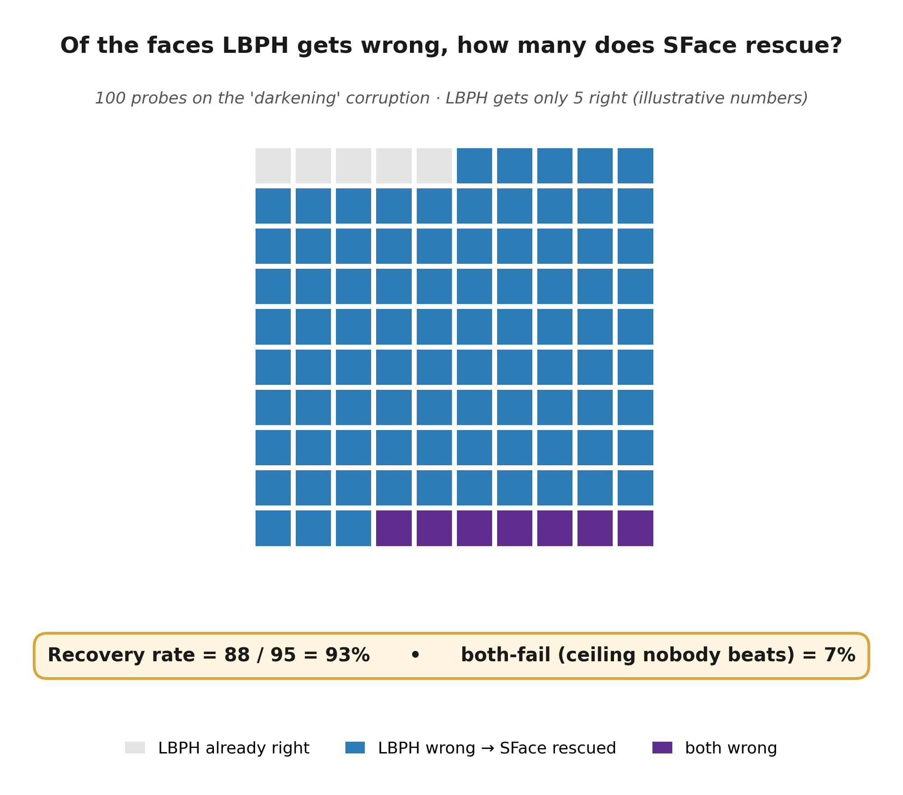
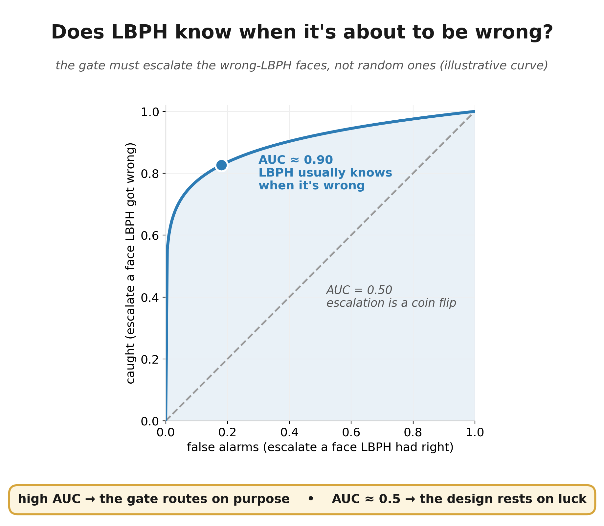
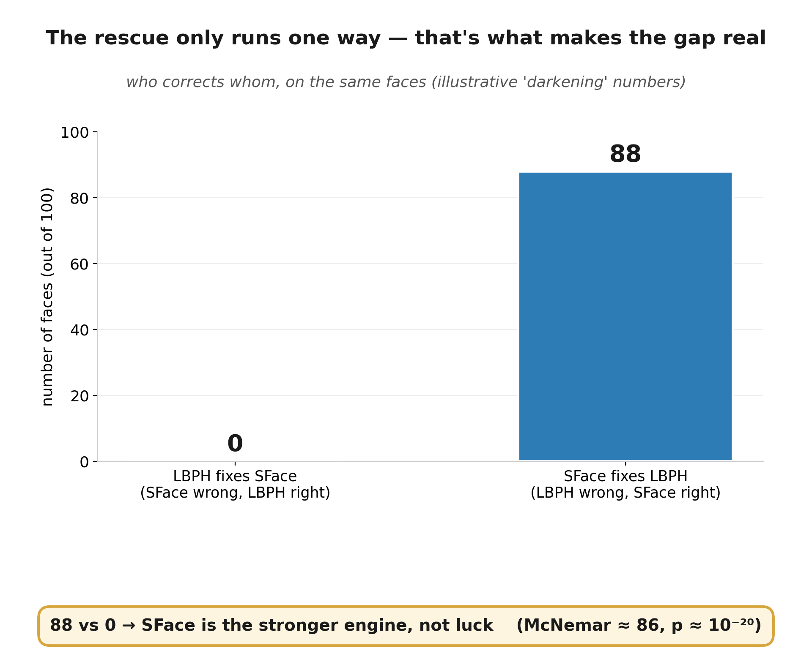
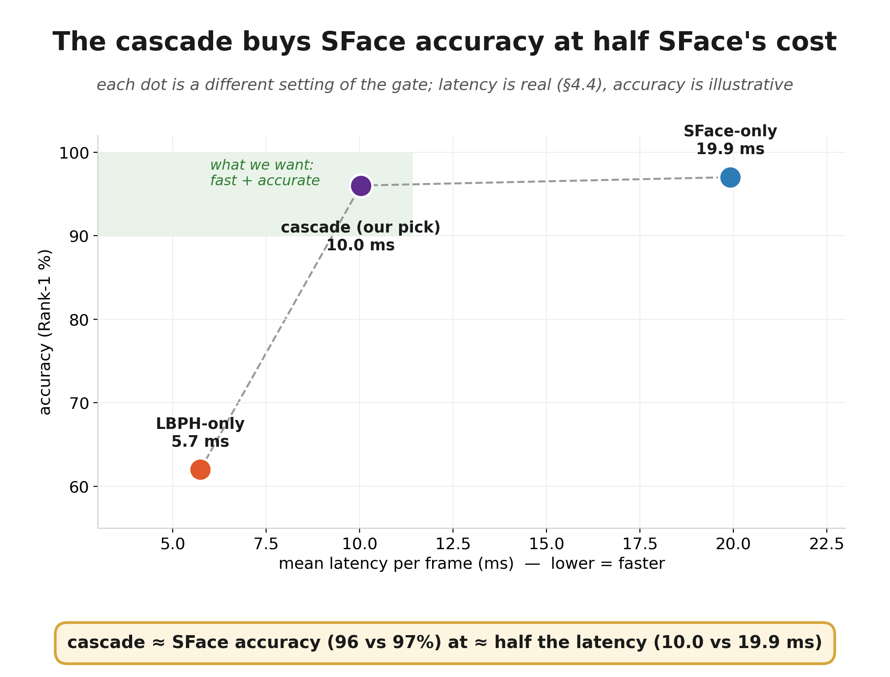

# Proving CV + DL actually help each other: the test battery

Companion to `../independence_test_expansion/WHY_AND_HOW.md`. That doc covers the
*security* axis (do the two engines false-accept the **same** impostors — Wilson CI,
Fisher, Yule's Q). **This doc covers the thesis itself:** CV is fast, DL is accurate,
DL rescues CV. Those are different questions and need different tests.

Latency / escalation numbers below are the ones already reported in paper §4.4–4.5.
The worked examples use made-up numbers (clearly marked) because these tests are not run
yet — the arithmetic is correct, the inputs are illustrative.

Figures live in this same folder: `fig1_recovery_rate.png`, `fig2_speed_accuracy_curve.png`,
`fig3_gate_auc.png`, `fig4_mcnemar_rescue_direction.png`. They use one consistent
illustrative scenario (the "darkening" corruption, 100 probes) so the four pictures tell
one connected story.

---

## The problem

- Our one-line thesis is *"CV = speed, DL = accuracy, DL saves CV."*
- That sentence is **four separate claims**, and we currently only measure two of them.
- We show LBPH is fast and SFace is accurate. We have **never directly measured the
  actual point of the whole design**: that when LBPH gets a face wrong, SFace gets it
  right — and that the gate knows *when* to hand off.
- "The engines are diverse" (Yule's Q, the other doc) is **not** that measurement. Q is
  about false-accepts on impostors; it says nothing about whether DL rescues CV's
  mistakes, or about speed. We've been leaning on the wrong number for the headline.

## The claim, split into things we can actually test

| # | What we claim | The test that proves it | Do we have it? |
|---|---|---|:--:|
| 1 | **CV is fast** | latency: cascade vs SFace-only | ✅ §4.4 |
| 2 | **DL is more accurate — and it's real, not noise** | Rank-1 gap **+ McNemar** (test 3 below) | ⚠️ implemented; held-out smoke result pending |
| 3 | **DL saves CV** — where LBPH fails, SFace succeeds | **recovery rate** (test 1 below) | ⚠️ implemented; held-out smoke result pending |
| 4 | **The cascade gets both, and routing isn't luck** | near-SFace accuracy at near-LBPH cost + **gate AUC** (tests 2 & 4) | ⚠️ partly |

Claims 1–4 are the thesis. The security/independence work (the other doc) is claim 5 —
real, worth doing, but **supporting**, not the headline. This doc fills the ❌ and ⚠️.

## The one table that answers most of it — and it's not new

We already run all engines on the same probes (`src/benchmark/accuracy_ratio_hybrid.py`
does this today). For each probe we already compute "did LBPH get the identity right?"
and "did SFace get the identity right?". Tally those into **one table** (note: this is
about *getting the identity right*, a different table from the false-accept one in the
other doc):

| | SFace right | SFace wrong |
|---|---:|---:|
| **LBPH right** | w | x |
| **LBPH wrong** | y | z |

Two of the four tests below read straight off this table. We are currently computing
`w, x, y, z` per probe and then **throwing the pairing away** — we only keep the totals.
Keeping the pairing is ~10 lines.

---

## 1. Recovery rate — the direct measurement of "DL saves CV"



**Stupidly simple version:** of all the faces LBPH got *wrong*, what fraction did SFace
get *right*? That single percentage is the entire thesis in one number. High = DL is
genuinely covering CV's failures. Low = the hybrid isn't buying us what we claim.

**Exact math** (straight off the table above):
```
recovery rate = y / (y + z)        # of LBPH's misses, the share SFace rescued
both-fail     = z / N              # neither got it — the accuracy ceiling no fusion beats
```

**How we use it:** report it **overall and per modification**. The story we expect (and
must show, not assume): on the corruptions that wreck LBPH — noise, blur, darkening,
where §4.4 reports LBPH's degraded Rank-1 collapsing to ~5% — recovery should be high,
i.e. SFace is catching almost everything LBPH drops. Also report `both-fail`: it is the
honest ceiling, the frames *nobody* gets, and stating it up front is what keeps this
defensible instead of salesy.

**Status / cost:** implemented. `accuracy_ratio_hybrid.py` records the paired outcomes,
and `merge_robustness_segments.py` now recomputes recovery from pooled `w/x/y/z` cells
for the canonical merged report. The held-out LFW smoke result remains pending until the
dataset and split manifest are available locally.

## 2. Gate competence (AUC) — does CV know when to call DL?



**Stupidly simple version:** the cascade only works if LBPH can tell when it's about to
be wrong — that's the whole basis for deciding to escalate to SFace. If LBPH's
confidence is just as high when it's wrong as when it's right, then escalation is a coin
flip and no amount of "the engines are diverse" saves us. This test checks that the
escalate/don't-escalate signal actually tracks LBPH being wrong.

**Stupidly simple version of the number:** feed the gate LBPH's own confidence signal
(the distance, and the top-1/top-2 margin from `src/hybrid/gate.py`) and ask it to
predict "will LBPH be wrong on this face?" **AUC** scores how well it separates the two:
```
AUC ≈ 1.0  → LBPH reliably knows when it's wrong → the cascade routes correctly
AUC ≈ 0.5  → LBPH has no idea when it's wrong → escalation is blind, design rests on luck
```

**How we use it:** it's the missing proof behind claim 4. We have *circumstantial*
evidence the gate routes well (§4.4: on the degraded split it escalates ~100% of frames,
89/98 on a quality flag; on clean it keeps ~75% of frames cheap with no accuracy loss).
AUC turns that from "look, the operating points seem sensible" into a measured property.

**Status / cost:** not computed yet. Small add — the gate signal and the "LBPH correct?"
label both exist per probe; we currently discard the signal. Surface it, compute AUC
offline.

## 3. McNemar's test — is the accuracy gap real, or noise?



**Stupidly simple version:** SFace scores higher than LBPH — but on a small test set,
could that gap just be luck? McNemar answers exactly that, and it reads off the **same
table** as the recovery rate. It looks only at the disagreements: the `x` faces LBPH got
right but SFace missed, versus the `y` faces LBPH missed but SFace got. If `y` hugely
outnumbers `x`, SFace is really the stronger engine — and that lopsidedness **is** the
rescue, stated as significance.

**Exact math:**
```
statistic = (|x - y| - 1)² / (x + y)      # McNemar with continuity correction
                                          # compare to χ² with 1 df; p < 0.05 = real gap
```

**How we use it:** one line certifying the premise "DL is the stronger engine on the
hard frames" is statistically real, not a sampling artifact. It's the paired,
same-probes version of the accuracy comparison — which a bare "97% vs 60%" is not.

**Status / cost:** implemented from the same table as test 1. The standard-library
helper reports exact and continuity-corrected forms; extremely small exact p-values are
rendered as bounds rather than a misleading literal zero.

## 4. Speed–accuracy operating curve — both benefits at once



**Stupidly simple version:** right now we show three dots — LBPH-only (fast, weak),
SFace-only (slow, strong), cascade (one chosen setting). A reviewer's first question is
"did you just pick the setting that looks good?" The fix: sweep the gate's aggressiveness
and draw the **whole curve** of accuracy vs. speed. The cascade should trace the line
between the fast corner and the accurate corner, and our deployed setting is just one
labelled dot on it (the figure above shows the three corners; the curve is what we add).

**How we use it:** upgrades §4.4 from "we picked 25% escalation and it worked" to "here
is the full speed/accuracy trade-off and here is where we chose to sit — on purpose."
That pre-empts the cherry-pick question and is a materially stronger claim.

**Status / cost:** medium. Re-run the existing benchmark while varying the gate
thresholds (`margin_min`, the τ band) and plot; no new machinery, just a sweep loop.

## 5. Security / error-independence — see the other doc

Cascade false-accepts vs the double-fault floor, observed-vs-expected joint errors,
Fisher's exact test, and Yule's Q live in `../independence_test_expansion/WHY_AND_HOW.md`.
**Key point for the pitch:** that axis is *supporting*, and its headline number (Q) only
means something on the large **LFW** sweep, not our 756-pair La Salle set — where Q
saturates to −1 as a small-sample artifact. So we lead the thesis with tests 1–4 here,
and treat the independence panel as the security follow-up, run at LFW scale.

---

## Worked examples (made-up numbers, correct arithmetic)

**Recovery rate — the "darkening" modification (illustrative).** Say 100 probes; LBPH
gets 5 right, 95 wrong (matches the ~5% degraded collapse). Of those 95 LBPH misses,
SFace rescues 88 and also misses 7:

| | SFace right | SFace wrong |
|---|---:|---:|
| **LBPH right** | w=5 | x=0 |
| **LBPH wrong** | y=88 | z=7 |

- recovery rate = 88 / (88+7) = **93%** — "SFace saves 93% of the faces LBPH drops."
- both-fail = 7 / 100 = **7%** — the honest ceiling: nobody gets these.
- McNemar: (|0−88|−1)²/(0+88) = 87²/88 ≈ **86**, χ²(1) → p ≈ 10⁻²⁰ — the gap is real.

One table, all three of the thesis's hard claims (rescue, ceiling, significance).

**Gate AUC (illustrative).** If the LBPH distance on the frames it got wrong is
consistently higher than on the frames it got right, the ROC comes out to AUC ≈ 0.9 —
"the gate can pick out the wrong-LBPH frames 9 times out of 10." If the distances
overlap completely, AUC ≈ 0.5 and the escalation is blind. We need to actually see which.

---

## Pass conditions — agree on these *before* we run (so it can't look cherry-picked)

| Test | Passes if |
|---|---|
| 1 Recovery rate | high overall, and **concentrated on the modifications where LBPH collapses** |
| 2 Gate AUC | clearly > 0.5, target > 0.8 (below that, the gate can't route and we must say so) |
| 3 McNemar | p < 0.05 with `y > x` (SFace the stronger engine on the hard frames) |
| 4 Operating curve | cascade point sits on the frontier: accuracy near SFace-only, latency near LBPH-only |

Pre-registering these is the single cheapest thing we can do to make the results
defensible — it turns "the numbers came out nice" into "the numbers met a bar we set in
advance."

## How we'll do it

1. **Recovery rate + both-fail + McNemar** — implemented in
   `accuracy_ratio_hybrid.py` and preserved by `merge_robustness_segments.py` when run
   with `--modes cv_only,dl_only,cascade`. The next required evidence run is the held-out
   LFW smoke protocol, not a new metric implementation.
2. **Gate AUC** — surface the LBPH distance/margin per probe (currently discarded), pair
   with the "LBPH correct?" label, compute ROC AUC offline.
3. **Operating curve** — sweep the gate thresholds, re-run the benchmark, plot
   accuracy vs. latency.
4. **Security panel at scale** — run the independence sweep (other doc) on **LFW**, not
   just La Salle, so Fisher/Q finally have the sample size to mean something.
5. Fold results into paper §4.3 (recovery per-mod), §4.4 (AUC + curve), §4.5 (security).

## What each test costs

| Test | Where | Effort | Proves |
|---|---|---|---|
| Recovery rate + both-fail | benchmark + segment merge | implemented; needs held-out run | **DL saves CV** (claim 3) |
| McNemar | same paired table + `src/stats_utils.py` | implemented; needs held-out run | accuracy gap is real (claim 2) |
| Gate AUC | near `src/hybrid/gate.py`, benchmark loop | small | routing isn't luck (claim 4) |
| Operating curve | `src/benchmark/`, sweep gate thresholds | medium | both benefits at once (claim 4) |
| Security panel @ LFW | `src/hybrid/independence_test.py` | run-only (already coded) | error independence (claim 5) |

Nothing here needs new data collection or new dependencies. Two of the four are
essentially free because we already compute the inputs and discard them; the rest is
running code we have at a larger scale.

## About the figures

The four figures above are **explainer** figures — one illustrative "darkening" scenario
so the pitch tells one connected story (5 LBPH-right → 88 rescued → 7 both-fail → the
88-vs-0 asymmetry → the AUC that makes routing non-random). They are made-up numbers with
correct arithmetic, exactly like the sibling `independence_test_expansion` figures.

Once the tests in "How we'll do it" actually run, we replace them with the **real-data**
versions, same layout:

- recovery rate **per modification** (bar per corruption: LBPH-miss vs SFace-rescued),
  so the mods where LBPH collapses stand out;
- the speed–accuracy curve as a **swept line**, not three points, with our chosen point on it;
- the gate ROC from the **actual** LBPH distances/margins, with the measured AUC.
