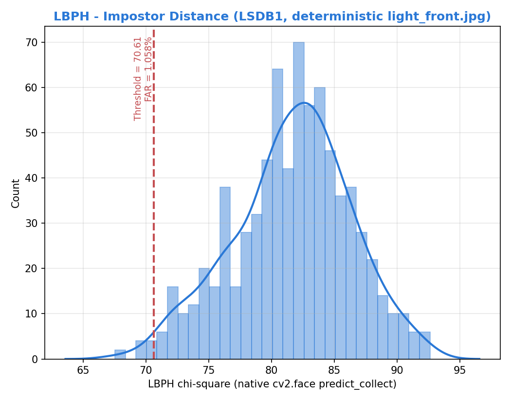
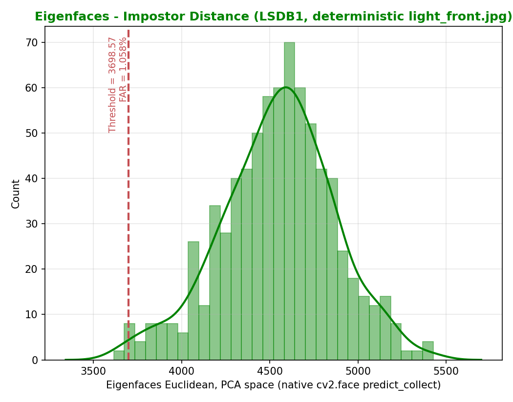
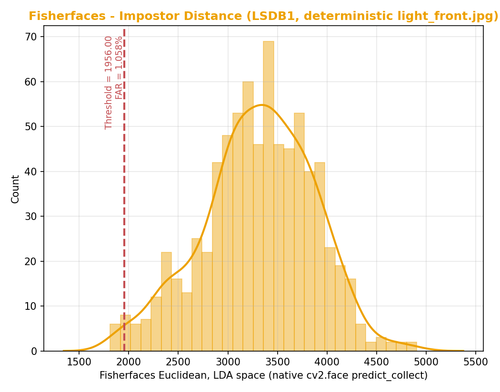

# Independence Test Rerun - LBPH vs Eigenfaces vs Fisherfaces (LSDB1)

Native-scale rerun: each model's rank-8 threshold is read straight off the
real deployed OpenCV recognizer (`cv.face.LBPHFaceRecognizer` /
`EigenFaceRecognizer` / `FisherFaceRecognizer`) via `predict_collect()` -
not a hand-rolled distance reimplementation. Each model's raw threshold is
therefore on its OWN native scale (chi-square for LBPH, Euclidean-in-PCA for
Eigenfaces, Euclidean-in-LDA for Fisherfaces) and the three are **not**
comparable to each other on one axis - that cross-model 0-100 normalization
has been retired (it previously misreported LBPH's threshold as 17.65,
~4x too small vs the real 70.61 predict-scale value).

Every identity's probe image is always `light_front.jpg` (deterministic -
same fix as the hybrid LBPH+SFace independence test), guaranteeing the
exact same N x (N-1) = 756 cross-identity comparisons on every run.

Dataset: `data/lasalle_db1_processed` - 28 identities, 756 ordered impostor pairs.
Threshold spec: 8th error pair (target FAR = 10,000 ppm), same operating point for all 3 models.

## Rank-based threshold (native scale per model)

| Model | Distance metric | Realized FAR (ppm) | Realized FAR (%) | Raw threshold | Boundary pair |
|---|---|---|---|---|---|
| LBPH | LBPH chi-square (native cv2.face predict_collect) | 10582.0 | 1.058% | 70.6089 | Trixia_Marie_Garcio vs Julian_Diego_Mapa |
| Eigenfaces | Eigenfaces Euclidean, PCA space (native cv2.face predict_collect) | 10582.0 | 1.058% | 3698.5661 | Thea_Ganza vs Diofel_Gwen_Haresco |
| Fisherfaces | Fisherfaces Euclidean, LDA space (native cv2.face predict_collect) | 10582.0 | 1.058% | 1956.0015 | Thea_Ganza vs Diofel_Gwen_Haresco |

## Distance distribution (native scale, NOT cross-model comparable)

| Model | Min | Max | Mean | Median | Std Dev |
|---|---|---|---|---|---|
| LBPH | 67.5250 | 92.6225 | 81.6486 | 82.0563 | 4.6510 |
| Eigenfaces | 3614.5279 | 5426.9918 | 4545.5314 | 4563.7343 | 321.5448 |
| Fisherfaces | 1812.2309 | 4905.8005 | 3308.8332 | 3346.5755 | 552.4043 |

Raw per-run outputs: `reports/independence/hybrid/lsdb1_fixed/` (LBPH), `reports/independence/{eigenfaces,fisherfaces}_lasalle_native/`.
