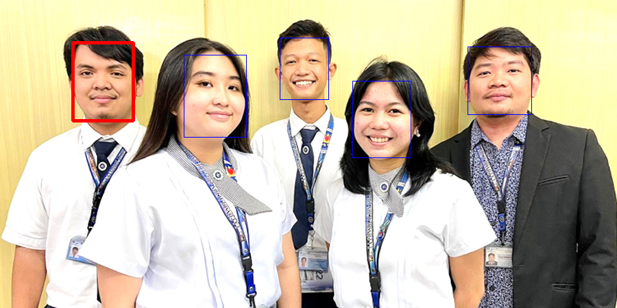
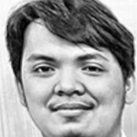

# Image Preprocessing Pipeline Walkthrough: `lcc.jpg`

This document details the step-by-step visual effects of the face preprocessing pipeline applied to the input image [lcc.jpg](../lcc.jpg). 

## 1. Do we use both Tan-Triggs and CLAHE?
**No. They are mutually exclusive.** 
In the project's [normalize_face](file:///C:/Users/acer/Downloads/USLS%204th%20Year/Computer%20Vision/face-detection-g3/src/classical_faces/preprocess.py#L169-L181) function, the configuration choose **one or the other** based on the model's setup:
* **Tan-Triggs Normalization**: Typically used for **LBPH** because the difference-of-Gaussians filtering is optimized to feed texture-based descriptors.
* **CLAHE (Contrast Limited Adaptive Histogram Equalization)**: Used for holistic models like **Eigenfaces** or **Fisherfaces** to equalize global lighting while avoiding local noise amplification.

Below, we show both paths side by side starting from the same aligned face.

---

### Step 1: Face Detection via YuNet (Selecting Leftmost Face)
* **Initial Detections**: 6 faces were detected.
* **Filtering**: Bounding boxes smaller than 40x40 pixels were discarded to filter out false positive noise. This left 5 valid faces.
* **Selection Policy**: Instead of choosing the largest face box (default), the pipeline selected the leftmost face (red bounding box, `Face 2` with $x=106$, score $= 0.93$).

---

### Step 2: Crop & Landmark-Based Alignment
* **Raw Crop (2a)**: Bounding box crop of the leftmost face. Any tilt or offset in the face pose is preserved.
* **Aligned Crop (2b)**: An affine transformation warps the face BGR image to a normalized template size of `200x200` using the 5 YuNet landmarks. This centers the facial features and eliminates head tilt.

* **Raw Crop (2a)**:

* **Aligned Crop (2b)**:

---

## 3. Normalization Branches (Separated Paths)

Here are the visual effects of the two different normalization algorithms applied to the grayscale aligned face.

### Branch A: Tan-Triggs Normalization
* **DoG Filtered (3a)**: Gamma correction and a Difference-of-Gaussians (DoG) filter highlight fine textures and edges while removing illumination gradients.
* **Final Resized (4a)**: The final input resized to `100x100` pixels.

* **3a. Tan-Triggs Output (200x200)**:

* **4a. Final Resized Input (100x100)**:

---

### Branch B: CLAHE Equalization
* **CLAHE Equalized (3b)**: Contrast Limited Adaptive Histogram Equalization improves contrast locally without amplifying pixel noise.
* **Final Resized (4b)**: The final input resized to `100x100` pixels.

* **3b. CLAHE Output (200x200)**:

* **4b. Final Resized Input (100x100)**:

