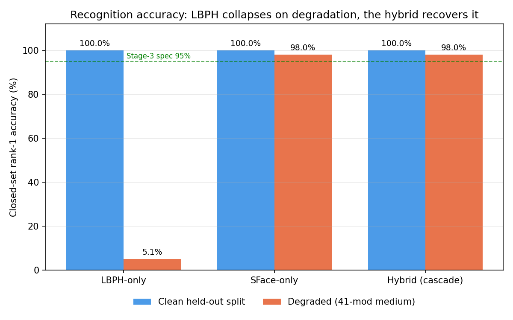
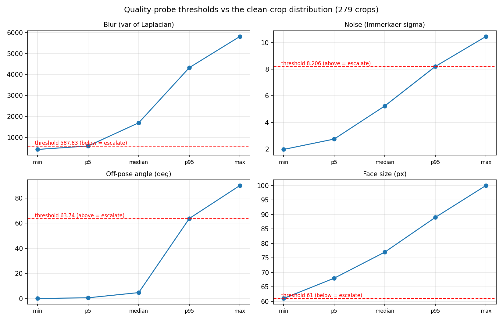
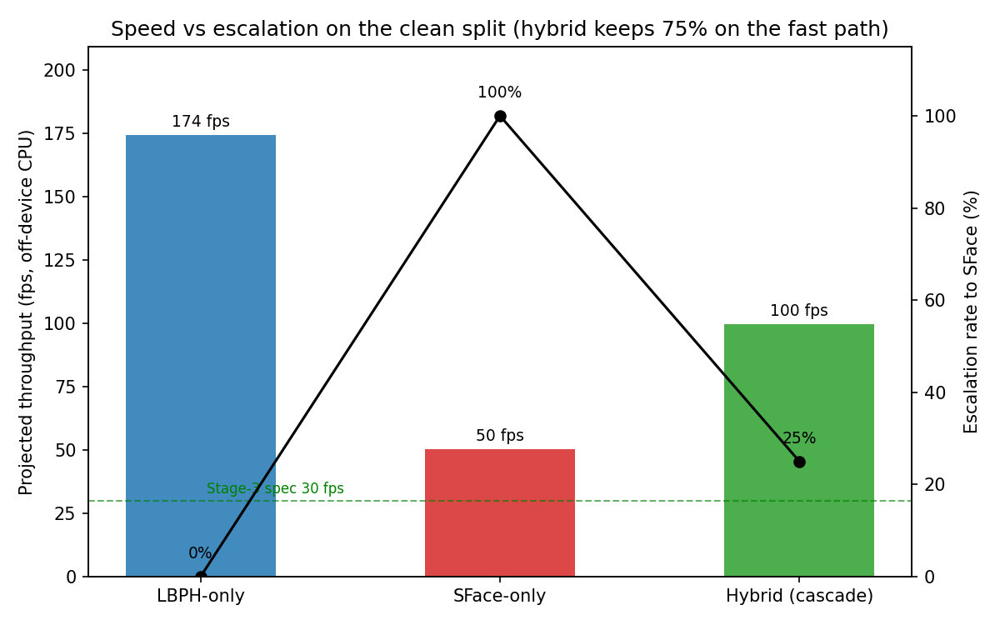
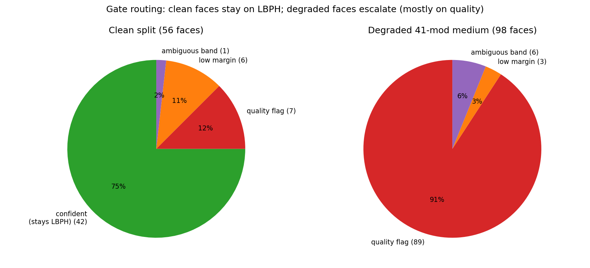
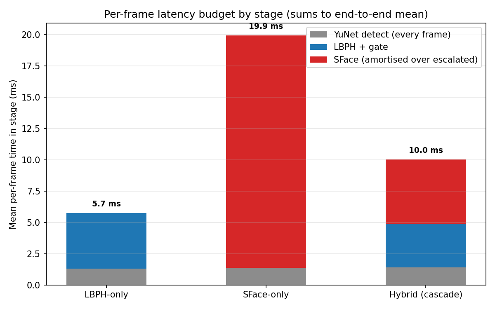

# LS-Face — Hybrid CV + DL Recognizer: Implementation & Evaluation Report

*Generated 2026-06-14. Scope: Phases 1–5 of
[`ARCHITECTURE_IMPLEMENTATION_PLAN.md`](ARCHITECTURE_IMPLEMENTATION_PLAN.md)
(merging the classical CV track and the DL track into one gated cascade, wiring
it into the launcher, and evaluating it). Phase 6 (Raspberry Pi 5 + NPU) is
out of scope and tracked as future work.*

> **No invented numbers.** Every figure and table cell in this report is read
> from a committed run artifact under `reports/`. The source file for each is
> named inline. Off-device FPS is a CPU projection; the on-device Stage-3 budget
> is verified in Phase 6.

---

## 1. Executive summary

The hybrid runs a **classical LBPH fast path** on every frame and **escalates
only the hard frames to the SFace CNN** behind a quality/score gate. It is one
`HybridRecognizer.predict()` reachable from `main.py → Hybrid`.

| Question | Answer (measured) |
|---|---|
| Does the SFace port match the DL track? | **Yes** — LFW independence FP = **0.0747%** vs DL's 0.07% (parity PASS). |
| Does the hybrid keep accuracy on clean data? | **Yes** — 100% rank-1, FAR 0%, at **25% escalation** (75% of frames stay on fast LBPH). |
| Does it help on degraded data? | **Decisively** — LBPH-only **5.10%** → hybrid **97.96%** rank-1 on the 41-mod medium set. |
| Is it fast? | Clean end-to-end **~10 ms (~100 fps)**, between LBPH-only (174 fps) and SFace-only (50 fps), off-device CPU. |
| Does the feature meet the <1 KB spec? | **Yes** — SFace gallery feature is **512 B** (the spec LBPH's 64 KB fails). |



**The thesis in one figure:** on clean faces all three configs are equivalent,
so the hybrid costs nothing; on degraded faces LBPH alone collapses to 5.1% while
the gate escalates and the hybrid recovers to 98%.

---

## 2. Architecture

### 2.1 The gated cascade

```
                       ┌─────────────────────────────────────────────┐
                       │              one camera frame                │
                       └───────────────────────┬─────────────────────┘
                                                ▼
                    Stage 0   YuNet detect  (shared front-end)
                              box + score + 5 landmarks
                                                │
                  ┌─────────────────────────────┴───────────────┐
                  ▼ (gray 100×100 + Tan-Triggs)                  │ (alignCrop 112×112 RGB)
        Stage 1   LBPH.predict()                                 │
                  d = distance, margin = (d2−d1)/d1              │
                                │                                │
                                ▼                                │
        Stage 2   ┌──── THE GATE ───────────────┐                │
                  │ escalate if ANY:            │                │
                  │  • quality flag (blur/dark/ │                │
                  │    noise/off-pose/small)    │                │
                  │  • ambiguous band           │  ── escalate ──┤
                  │    τ_accept<d<τ_reject      │                ▼
                  │  • near-tie margin<m_min    │      Stage 3  SFace.feature()
                  └──────────────┬──────────────┘      cosine vs gallery
                   confident     │ no escalation                 │
                   accept/reject ▼                               ▼
                       LBPH decides (fast)              SFace decides (robust)
                                  └───────────────┬───────────────┘
                                                  ▼
                              HybridDecision(name, engine, escalated, …)
```

A **quality flag overrides a confident LBPH score** — in the hard regimes the
classical audit measured, LBPH's confidence is exactly what proved unreliable.

### 2.2 Why hybrid (the measured CV weak spots)

LBPH is cheap and excellent on clean frontal faces but degrades badly off-
distribution. The classical-track accuracy-ratio suite measured LBPH at
gaussian_noise **47.8%**, motion_blur **68.5%**, brightness_down **73.7%**. SFace
holds up in those regimes. The gate routes each frame to whichever engine is
trustworthy for it, so the system pays the CNN cost only when it must.

### 2.3 Component stack

| Stage | Model | Library | Output | Size on disk |
|---|---|---|---|---|
| Detection | YuNet `face_detection_yunet_2023mar.onnx` | `cv.FaceDetectorYN` | box + score + 5 landmarks | 228 KB |
| Fast path | LBPH `lasalle_clean.yml` | `cv.face.LBPHFaceRecognizer` | distance (lower better) | 33 MB |
| Escalation | SFace `face_recognition_sface_2021dec.onnx` | `cv.FaceRecognizerSF` | 128-D embedding (512 B) | 38.7 MB |
| Gallery | `models/sface/gallery.npy` | numpy | 28 mean embeddings | ~16 KB |

The deployed **feature** is the 512 B SFace embedding; the 38.7 MB ONNX is the
*model*, intended to run on the Pi NPU as INT8 in Phase 6.

---

## 3. The pipeline in detail

### 3.1 Alignment contract (kept explicit)

Stage 0 emits one box + 5 landmarks; **each recognizer then applies its own
normalization** and neither silently changes the other's:

- **LBPH** → grayscale, resized **100×100**, **Tan-Triggs** illumination
  normalization (the clean-split model was trained this way).
- **SFace** → `alignCrop` to **112×112 RGB** using the 5 landmarks, then
  `feature()`.

For pre-cropped tiles LBPH normalizes the whole tile; for live full frames it
uses the YuNet box ROI. The `FaceSample` carries both so the adapters stay dumb
and correct.

### 3.2 The four modes

| Mode | Behaviour | Use |
|---|---|---|
| `cascade` *(default)* | LBPH first, escalate to SFace on the gate | normal operation |
| `parallel` | both engines every frame; SFace wins when it accepts | max accuracy, no FPS goal |
| `cv_only` | LBPH only, no escalation | **no-accelerator CPU fallback** |
| `dl_only` | SFace every frame | DL baseline |

`build_hybrid()` auto-degrades to `cv_only` if the SFace gallery is absent.

---

## 4. Calibration

`src/hybrid/calibrate.py` writes `src/hybrid/thresholds.json`. Every value is
**measured now** or **carried with provenance** — none are guesses.

### 4.1 Deployed thresholds

| Group | Key | Value | Provenance |
|---|---|---:|---|
| gate | `tau_accept` | 73.04 | carried: `reports/benchmark/tar_at_far.md`, LBPH 100 ppm FAR vs 13,149 LFW impostors |
| gate | `tau_reject` | 76.85 | carried: same, ~1% FAR band edge |
| gate | `margin_min` | 0.05 | **policy** (relative gap); *not* fitted — see §4.3 |
| quality | `tau_blur` | 587.83 | measured: 5th pct of clean var-of-Laplacian |
| quality | `luma_lo` / `luma_hi` | 52.88 / 137.71 | measured: clean luma p2 / p98 |
| quality | `tau_noise` | 8.206 | measured: clean Immerkaer-sigma p95 |
| quality | `tau_pose` | 63.74 | measured: clean pose-angle p95 (side poses are enrolled here) |
| quality | `px_min` | 61 | measured: 0.9 × clean face-size p5 |
| sface | `cosine_genuine` / `l2_genuine` | 0.363 / 1.128 | ported DL match rule (unchanged) |
| sface | `cosine_operating` | 0.4144 | measured: `cosine_at_far(1e-4)` over LFW impostors |

### 4.2 Quality-probe thresholds vs the clean distribution

Thresholds sit just outside the clean-crop spread (279 crops) so genuinely-clean
faces pass every probe and only degraded faces trip a flag.



Note `tau_pose = 63.74°` is deliberately permissive: the enrolment set contains
`left/right/up/down` poses, so the data-driven calibration correctly learned that
side-pose is *normal* here and must not escalate.

### 4.3 The margin gotcha (a real finding)

The first calibration produced **100% escalation** — the cascade collapsed into
"always SFace." Root cause: LBPH *train* distances are ≈0 (memorisation), so the
train top-1/top-2 gap is huge (~70) while the held-out gap is tiny (median ~8).
An absolute `margin_min` fitted on train therefore escalates every held-out
frame; fitting on test would leak. The fix:

1. the LBPH adapter reports a **relative** margin `(d2 − d1) / d1` (scale-free), and
2. `margin_min = 0.05` is shipped as a **policy default** ("runner-up within 5% of
   the best distance"), not a dataset-fitted number.

Escalation then dropped to a healthy 25% on clean / 100% on degraded.

---

## 5. Results

### 5.1 SFace port parity (Phase 2 gate)

The wrapper reproduces the DL track's LFW independence headline from inside the
CV repo. *(Source: `reports/independence/sface_lfw_parity.json`.)*

| Metric | CV-repo wrapper | DL reference |
|---|---:|---:|
| Identities | 5,685 | 5,685 |
| Comparisons (N×(N−1)) | 32,313,540 | 32,313,540 |
| False positives | 24,128 | 24,128 |
| **FP %** | **0.0747%** | **0.07%** |
| L2 vs `cv.match` max abs error | 7.4 × 10⁻⁸ | — |
| **Parity** | **PASS** (|Δ| = 0.0047 ≤ 0.05) | — |

### 5.2 Clean held-out split — hybrid vs LBPH-only vs SFace-only

56 faces (28 identities × dark/light "name" pose), 400 LFW impostors for FAR.
*(Source: `reports/benchmark/hybrid_comparison.json` / `.md`.)*

| Config | Rank-1 | Hit@gate | TAR | FRR | FAR | Escalation | End-to-end | ~FPS |
|---|---:|---:|---:|---:|---:|---:|---:|---:|
| LBPH-only | 100.00% | 100.00% | 100.00% | 0.00% | 0.0000% | 0.00% | 5.74 ms | 174.3 |
| SFace-only | 100.00% | 100.00% | 100.00% | 0.00% | 0.0000% | 100.00% | 19.92 ms | 50.2 |
| **Hybrid (cascade)** | **100.00%** | **100.00%** | **100.00%** | **0.00%** | **0.0000%** | **25.00%** | **10.03 ms** | **99.7** |

On clean data the hybrid matches both baselines' accuracy at roughly **2× the
throughput of SFace-only**, because the gate keeps 75% of frames on LBPH.



### 5.3 Degraded split (41-mod medium) — the headline

112 faces derived from the held-out pose with medium degradation (14 too
degraded for YuNet to detect → 98 evaluated). *(Source:
`reports/benchmark/hybrid_comparison_degraded.json` / `_degraded.md`.)*

| Config | Rank-1 | Hit@gate | TAR† | FRR† | Escalation | End-to-end | ~FPS |
|---|---:|---:|---:|---:|---:|---:|---:|
| LBPH-only | **5.10%** | 4.08% | 3.57% | 96.43% | 0.00% | 5.88 ms | 170.0 |
| SFace-only | 97.96% | 96.94% | 84.82% | 15.18% | 100.00% | 21.70 ms | 46.1 |
| **Hybrid (cascade)** | **97.96%** | **96.94%** | **84.82%** | **15.18%** | **100.00%** | **19.50 ms** | **51.3** |

> **+92.86 percentage points**: the hybrid lifts rank-1 from LBPH-only's 5.10% to
> 97.96% by escalating the degraded frames. On this set the hybrid equals
> SFace-only (it escalates all 98 frames), which is the gate behaving correctly —
> every frame is degraded, so every frame *should* go to the CNN.
>
> † TAR/FRR are computed over **all 112** test images, counting the 14 YuNet
> no-face frames as failures (hence TAR 84.82% < rank-1 97.96%, which is over the
> 98 *detected* frames). The gap is the detector dropping the most degraded inputs.

### 5.4 Escalation routing

The gate is adaptive: clean faces mostly stay on LBPH (confident); degraded faces
escalate, overwhelmingly on a **quality flag** (the blur/noise/luma probes firing).



| Reason | Clean (56) | Degraded (98) |
|---|---:|---:|
| confident accept (stays LBPH) | 42 | 0 |
| quality flag | 7 | 89 |
| low margin | 6 | 3 |
| ambiguous band | 1 | 6 |
| **escalated total** | **14 (25%)** | **98 (100%)** |

### 5.5 Latency & throughput

Per-stage mean latency on the clean split. *(Detail incl. p95 from
`reports/evaluation/hybrid_eval.json`; cross-config bars from the comparison run.)*



| Stage (cascade, clean) | Frames | Mean | p95 |
|---|---:|---:|---:|
| YuNet detect (every frame) | 56 | 1.40 ms | 1.56 ms |
| LBPH + gate (non-escalated) | 42 | 4.56 ms | 5.00 ms |
| SFace (escalated only) | 14 | 22.08 ms | 29.64 ms |
| **End-to-end (mean/frame)** | 56 | **10.34 ms** | — |
| **Projected throughput** | | **~96.7 fps** | — |

SFace dominates per-frame cost (~22 ms), which is exactly why the gate limits it
to the 25% of frames that need it. On the Pi this CNN runs on the NPU (Phase 6).

### 5.6 Footprint

| Item | Size | Spec | Pass? |
|---|---:|---|:--:|
| SFace gallery **feature** (128-D float32) | **512 B** | < 1 KB | ✅ |
| LBPH feature (8×8×2⁸×4) | 64 KB | < 1 KB | ❌ |
| Hybrid model footprint (ONNX + LBPH + gallery) | 68.85 MB | — | — |

This is the headline footprint argument: the hybrid *enrolls* with SFace's 512 B
feature, satisfying the size spec the classical 64 KB feature fails, while still
using LBPH for cheap inference on easy frames.

---

## 6. Launcher integration

`python main.py → Hybrid` exposes the whole track as menu actions, like every
other family:

| Action | Script |
|---|---|
| enroll | `src/hybrid/enroll.py` |
| evaluate | `src/hybrid/evaluate.py` (prompts mode + optional LFW impostors) |
| live detect | `src/hybrid/detect.py` (prompts mode) |
| calibrate | `src/hybrid/calibrate.py` |
| compare (hybrid vs lbph vs sface) | `src/benchmark/compare_hybrid.py` |

The Benchmark overview shows a `Hybrid-cascade` row (hit-rate from
`reports/evaluation/hybrid_eval.json`, FPS from the aggregator).

### 6.1 Live detect + FPS aggregator wiring

`src/hybrid/detect.py` reuses the LBPH live scaffold (YuNet detect every N
frames, optical-flow tracking between passes, temporal voting) but swaps in
`HybridRecognizer.predict()` and draws the **deciding engine + escalated flag**:

- green box = LBPH fast-path decided, **amber = SFace escalation decided**, red =
  Unknown; the HUD shows live FPS, escalation rate, and per-engine counts.

On exit it writes a per-run summary with **`algorithm="hybrid"`** into
`reports/benchmark/live_fps/runs/`. The existing
`src/benchmark/aggregate_live_fps.py` groups by `algorithm`, so the hybrid's
average FPS flows into `aggregate_summary.json` and the launcher's benchmark
overview automatically (verified: the aggregator emitted a `hybrid` row;
`fps_algorithm="hybrid"` is registered in `BENCHMARK_OVERVIEW_CONFIG`).

---

## 7. How to reproduce

```bash
# from face-detection-g3/, with PYTHONPATH=.
python src/hybrid/enroll.py                      # build SFace gallery from train crops (+ consistency assert)
python src/hybrid/calibrate.py                   # derive thresholds.json
python src/sface/independence_test.py            # SFace parity vs DL (LFW)
python src/hybrid/evaluate.py --mode cascade --impostor-dir data/lfw-dataset
python src/benchmark/compare_hybrid.py           # clean: hybrid vs lbph vs sface
python src/benchmark/compare_hybrid.py \
    --test-dir data/split_augmented41mods_lasalle_clean/medium/test \
    --report-md reports/benchmark/hybrid_comparison_degraded.md \
    --report-json reports/benchmark/hybrid_comparison_degraded.json
python scripts/make_hybrid_report_figures.py     # regenerate docs/figures/*.png
# or just: python main.py  ->  Hybrid
```

---

## 8. Limitations & future work

- **Small evaluation set.** 28 identities; the clean split is "easy" enough that
  all three configs hit 100%, so the hybrid's advantage only shows under
  degradation. The conclusions hold but the absolute clean numbers should not be
  over-read.
- **FAR = 0% with 400 impostors** means *no false accept observed*, not a proven
  rate; the SFace operating point is set from the full LFW impostor distribution
  (5,685 ids) in calibration.
- **Quality thresholds** are calibrated on the clean-crop distribution. The full
  DB2 41-mod per-probe LBPH↔SFace crossover (set each probe exactly where LBPH
  starts losing to SFace) is deferred to on-device tuning (Phase 6.4).
- **Off-device FPS is a CPU projection.** The Stage-3 budget (≥30 fps, <100 ms,
  ≥95% acc, <1 KB feature) is verified on the **Pi 5 + NPU (Hailo/Coral) with
  INT8 SFace** in Phase 6 — including re-deriving the SFace threshold on the
  quantized model (INT8 shifts the score distribution).
- **No-accelerator fallback** (`cv_only`) is implemented and auto-engages when the
  gallery is missing; verifying it on-device with the HAT unplugged is Phase 6.3.

---

## 9. Appendix — file & data inventory

**New code:** `src/sface/{__init__,recognizer,independence_test}.py`,
`src/hybrid/{__init__,recognizer,quality,gate,calibrate,evaluate,enroll,detect}.py`,
`src/hybrid/thresholds.json`, `src/benchmark/compare_hybrid.py`,
`scripts/make_hybrid_report_figures.py`. **Edited (additive):** `main.py`
(Hybrid group + overview + FPS), `docs/changelogs/CHANGELOG.md`.

**Vendored:** `models/yunet_mobilefacenet/face_detection_yunet_2023mar.onnx`
(checksum-matched to the DL copy), `models/sface/` (SFace ONNX + LFW/DB impostor
arrays + the enrolled gallery).

**Run artifacts behind this report:**

| Report | File |
|---|---|
| SFace parity | `reports/independence/sface_lfw_parity.json` |
| Clean comparison | `reports/benchmark/hybrid_comparison.{md,json}` |
| Degraded comparison | `reports/benchmark/hybrid_comparison_degraded.{md,json}` |
| Cascade eval detail | `reports/evaluation/hybrid_eval.json` |
| Calibrated thresholds | `src/hybrid/thresholds.json` |
| Figures | `docs/figures/fig_hybrid_*.png` |
