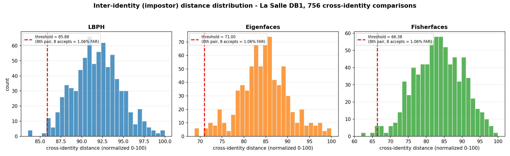
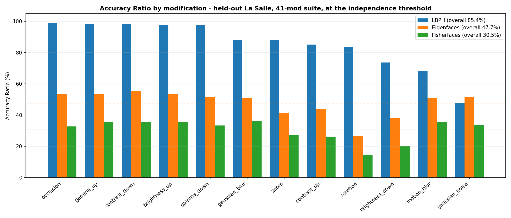
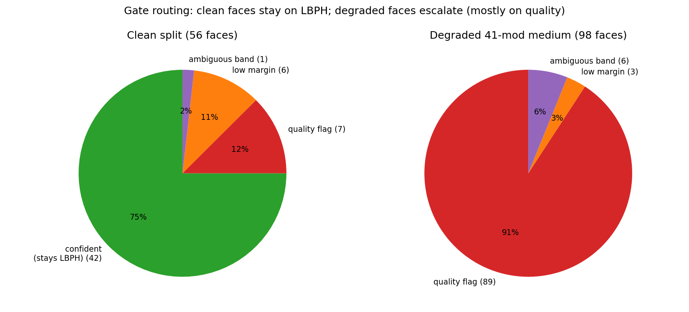

# Facial Recognition Using Hybrid Technologies Based on Independence Testing

[Author names], Group 3
[College], University of St. La Salle, Bacolod City, Philippines
[email]

> **Length target:** 6 pages max in the IEEE two-column template (body ≈ 3,600 words + 4 figures + 5 tables). Items marked **[PENDING]** are produced by scripts that are already in the repository but have not been run yet; fill them in and delete the tags before submission. If the filled-in tables push past 6 pages, trim in this order: §4.1 threshold detail, §2, the §4.7 discussion — never the confidence intervals or the transfer results.

---

**Abstract.** A camera-based Smart Gate must recognize enrolled people accurately, respond in real time, and run on cheap edge hardware. No single method does all three: classical computer-vision (CV) recognizers such as LBPH are small and fast but break under bad lighting, blur, and noise, while deep-learning (DL) recognizers such as SFace are robust but cost far more compute. This paper shows that the two families are *complementary* — each one is strong exactly where the other is weak — and builds LS-Face, a gated cascade that runs LBPH on every frame and forwards only hard frames to SFace. The evidence comes from independence testing: exhaustive N×(N−1) cross-identity comparison, where every pair is an impostor pair by construction, so the match threshold can be read directly off the impostor distance distribution at a chosen false-acceptance rate (FAR). On a leakage-free La Salle split, LBPH with Tan-Triggs normalization reaches 98.21% true acceptance at 76 ppm FAR against 13,149 LFW impostors; SFace independently passes the same protocol on LFW with a 0.0747% false-positive rate over 32.3 million comparisons. On clean images the cascade keeps 100% rank-1 accuracy while escalating only 25% of frames (≈100 fps, twice SFace-only); on degraded images the gate escalates everything and lifts rank-1 from LBPH's 5.10% to 97.96%. A joint independence test that scores both engines on the same impostor pairs, and a shared 41-modification robustness suite for CV, DL, and the cascade, complete the complementarity argument.

**Keywords.** face recognition, independence testing, threshold determination, hybrid method, classical computer vision, edge deployment

## 1. Introduction

Automated gates need a recognizer that (a) admits enrolled users reliably, (b) rejects strangers with very high confidence, (c) answers in a fraction of a second, and (d) runs on low-cost hardware such as a Raspberry Pi 5.

Two method families each satisfy only part of this list. Classical CV recognizers — Eigenfaces [1], Fisherfaces [2], LBPH [3] — are tiny, train in seconds, and predict in under a millisecond on a CPU, but their accuracy collapses under illumination change, pose, blur, and noise. Lightweight DL recognizers — SFace [4], MobileFaceNet [7], EdgeFace [9] — stay accurate under those corruptions but cost 2–4× more per frame. Our central claim is that this is not a tie to be broken but a *complementarity to be exploited*: the CV engine supplies the lightness the DL engine lacks, and the DL engine supplies the robustness the CV engine lacks. A hybrid that routes each frame to the cheapest engine that can be trusted with it gets close to the best of both.

A second problem is setting the match threshold. Verification reduces to "accept if the feature distance is below θ," and picking θ is easy only when many labeled genuine and impostor pairs exist [12]. Real enrollment has a small gallery and no negative pairs at all. LS-Face solves this with **independence testing**: build a database with exactly one image per identity, compare every image to every other one — N×(N−1) ordered comparisons, all impostor pairs by construction — and read θ off that empirical impostor distribution at the target FAR. The same sweep doubles as a health check: it exposes recognizers whose impostor distances collapse (no usable threshold exists) and near-zero-distance pairs that flag annotation errors.

This paper contributes: (1) a common benchmark of three classical recognizers against a lightweight DL recognizer under one preprocessing, evaluation, and reporting framework, with detection migrated from Viola-Jones [5] to YuNet [10] on a measured head-to-head; (2) an independence-testing protocol that derives thresholds at specified FARs on both the La Salle database and LFW [11]; (3) a *joint* independence test that scores both engines and the fused cascade on the same impostor pairs, measuring whether their errors overlap — the direct statistical test of complementarity, quantified with the standard classifier-diversity measures [15], exact tests, and confidence intervals; (4) a shared 41-modification robustness suite applied to CV, DL, and the hybrid, showing which corruption each family survives; and (5) a gated cascade that converts the measured complementarity into a deployable system.

Section 2 reviews related work, Section 3 describes the method, Section 4 gives results, Section 5 concludes.

## 2. Related Work

**Classical recognition.** Eigenfaces [1] projects faces onto PCA components; Fisherfaces [2] adds LDA to separate classes; LBPH [3] compares local binary-pattern histograms per face region. All three ship in OpenCV [13], need no GPU, and produce models from kilobytes to a few megabytes.

**Deep recognition.** FaceNet [6] mapped faces to an embedding space with triplet loss; ArcFace [14] added an angular margin; SFace [4] uses a sigmoid-constrained hypersphere loss; MobileFaceNets [7] (built on MobileNetV2 [8]) and EdgeFace [9] target edge devices at 1–2 M parameters.

**Detection.** Viola-Jones Haar cascades [5] remain the classical baseline; YuNet [10] is a millisecond-scale CNN detector that also returns five landmarks, which DL recognizers use for alignment.

**Evaluation.** Biometric practice separates true acceptance rate (TAR), FAR, and false rejection rate (FRR) [12]. LFW [11] tests verification on fixed pair lists. Independence testing differs: one image per identity plus exhaustive comparison yields the *whole* impostor distribution, so a threshold can be tied to an exact error count rather than a sampled pair list. For the claim that two recognizers *complement* each other, the multiple-classifier-systems literature already provides the standard yardsticks — pairwise diversity measures such as Yule's Q-statistic and the double-fault rate [15] — which we adopt rather than invent our own.

## 3. Method

### 3.1 System overview

LS-Face processes one camera frame as follows. A shared YuNet front-end returns one face box, a confidence, and five landmarks. The frame first takes the cheap path: LBPH (grayscale 100×100 crop, Tan-Triggs illumination normalization) predicts an identity and a distance d. A **gate** then decides whether that answer can be trusted. If yes, LBPH's decision stands and the DL model never runs. If not, the frame **escalates**: SFace aligns the face to 112×112 with the landmarks, extracts a 128-D (512-byte) embedding, and matches it against per-identity mean embeddings by cosine similarity. A no-accelerator fallback (LBPH alone) engages automatically if the DL gallery is absent.

### 3.2 Independence testing and threshold rule

Take N identities with one image each. Comparing every image against every other gives

  C = N × (N − 1)  ordered comparisons, (1)

all impostor pairs by construction. Sort the C distances ascending. To operate at a target false-acceptance rate FAR*, choose the rank

  k = ⌈ FAR* · C ⌉, (2)

and set the threshold θ to the k-th smallest impostor distance: exactly k impostor pairs fall inside θ, so the realized FAR is k/C. On La Salle DB1 (N=28, C=756) the design point is the 8th error pair, i.e. FAR = 8/756 ≈ 1.06%; 756 comparisons cannot resolve finer than ~1,300 ppm, so the spec budget of 100 ppm is certified on LFW DB1 (N=5,749, C=33,045,252; the 331st pair ≈ 10 ppm). The rule reproduces both spec anchors exactly. For the complete mathematical formalism—including the probability model, extreme-value connections, and comparison with the LFW sampled-pair protocol—see `docs/report_docs/independence_test/MATHEMATICAL_FOUNDATION.md` in the project repository.

### 3.3 The escalation gate

Let d₁ and d₂ be the best and second-best LBPH distances, and let τ_a < τ_r be the accept and reject thresholds from independence testing. The gate escalates a frame to SFace if **any** of:

  (i) a quality flag fires — blur, low light, sensor noise, off-pose, or too-small face, measured on the same crop LBPH already holds;
  (ii) the score is ambiguous: τ_a < d₁ < τ_r;
  (iii) the top-two margin is thin: (d₂ − d₁)/d₁ < m_min. (3)

The margin is *relative* because LBPH training distances are near zero by memorization; an absolute margin fitted on training data escalates every held-out frame. A quality flag deliberately overrides a confident LBPH score: the corrupted regimes are exactly where LBPH confidence is least trustworthy. If nothing fires, d₁ ≤ τ_a accepts on LBPH and d₁ ≥ τ_r rejects.

### 3.4 Robustness: the 41-modification accuracy ratio

Every original image receives 41 deterministic (modification, level) variants across 12 types: brightness up/down, contrast up/down, gamma up/down, Gaussian noise, Gaussian blur, motion blur, rotation, zoom, occlusion. A modified probe *matches* when the recognizer outputs the correct identity within the deployed threshold. With M probes and K matches,

  AR = K / M, (4)

averaged per modification over its levels, then over modifications for the overall score. The suite is seeded per (image, modification, level), so CV, DL, and hybrid are scored on bit-identical probes.

### 3.5 Testing complementarity directly

Complementarity has two measurable halves. *Robustness complementarity*: per modification, compare AR_CV against AR_DL (Section 3.4) — complementary methods win on disjoint modification sets, and the cascade should track max(AR_CV, AR_DL) per modification. *Error independence*: on the same N×(N−1) impostor sweep, flag each pair a CV false accept (d ≤ τ_a) and/or a DL false accept (cosine ≥ 0.363 and L2 ≤ 1.128). If the engines erred independently, the expected number of joint errors would be

  E[both] = C · P(FP_CV) · P(FP_DL). (5)

An observed joint count at or below E[both] means the engines rarely fail on the same impostor pair, so a cascade can filter one engine's mistakes with the other. The same sweep also reports the fused cascade's own false-accept count under the deployed gate.

Raw counts are not enough on a small database, so three standard statistics accompany them. Every rate carries a 95% Wilson confidence interval — with only 756 comparisons per La Salle sweep, a bare "1% FAR" hides an interval of roughly 0.5–2%. Association between the two engines' errors is tested with Fisher's exact test on the 2×2 table (CV-error × DL-error): a small p-value in the "co-occur" direction would *refute* complementarity. Finally, the classifier-diversity measures of Kuncheva and Whitaker [15] summarize the same table:

  Q = (ad − bc) / (ad + bc),  DF = a / C, (6)

where a = both engines err, b/c = exactly one errs, d = neither. Q < 0 means the engines fail on *different* pairs (complementary); the double-fault rate DF is the error floor that no fusion of the two engines — cascade, voting, or otherwise — can beat.

### 3.6 One threshold set, four databases

Good numbers on four separately tuned databases would only show that the method is *tunable*. The generalization claim needs *transfer*: every threshold (τ_a, τ_r, m_min, and the SFace genuine rule) is derived once on La Salle DB1, frozen (the harness records the file's SHA-256), and applied unchanged to every other database. The gallery/enrollment side is always clean originals; only probes are ever modified. Each database then answers one question (Table 1):

**Table 1 — Evidence matrix (`src/benchmark/evidence_matrix.py`).**

| Database | Test | What it proves |
|---|---|---|
| La Salle DB1 (28 ids, clean) | independence sweep, 10 seeded repeats | in-domain FAR at the frozen thresholds (they were derived here) |
| La Salle DB2 (41 mods) | accuracy ratio, CV / DL / cascade / parallel | robustness under degradation; per-modification winners |
| LFW DB1 (5,749 ids, clean) | independence sweep | out-of-domain transfer with real statistical power (millions of pairs) |
| LFW DB2 (41 mods, 1 image/id) | independence sweep on modified probes | degradation and identity separation jointly, out of domain |

The cascade's natural rival is also in the table: a *parallel* mode that runs both engines on every probe is the accuracy ceiling at full DL cost, and the cascade must stay within tolerance of it while escalating only a fraction of frames — otherwise the gate is not earning its keep.

## 4. Experiments and Results

**Databases.** La Salle DB1: 28 people × 12 pre-cropped 100×100 images; leakage-free split of 10 gallery + 2 held-out probe images per identity (280/56); train–test image-disjointness verified. La Salle DB2: the 41-variant suite applied to DB1 (held-out probes: 56×41 = 2,296). LFW DB1 [11]: 5,749 people, 13,233 photos (13,149 usable after Haar cropping) as the impostor set. All pipelines share preprocessing and detection settings, except each family uses its measured-best illumination normalization (Tan-Triggs for LBPH; histogram equalization for the subspace methods), single-sourced so training, evaluation, and thresholding cannot drift apart.

**Detection.** On 336 controlled La Salle photos YuNet detected 100% of faces with zero false positives at 48.6 fps, versus Haar's 86.9% with 43 false positives at 37.2 fps; Haar's misses concentrate on non-frontal and dark shots a gate must tolerate. On 600 LFW images both saturate recall and YuNet is faster (359 vs 129 fps) with a 4× smaller model that also outputs the landmarks SFace needs. YuNet is therefore the selected detector.

### 4.1 Independence testing per engine

On La Salle DB1 (756 comparisons, 8th error pair = 1.058% FAR) the impostor thresholds are LBPH 21.35 raw (85.88 normalized), Eigenfaces 8,098.46 (71.00), Fisherfaces 5,446.46 (66.38); LBPH keeps impostors farthest apart (Fig. 1). The corresponding deployable thresholds on each recognizer's own predict scale at the 100 ppm budget are LBPH 73.0, Eigenfaces 4,308, Fisherfaces 738. The sweep also surfaced near-zero pairs that were investigated rather than assumed: on La Salle they traced to a normalization floor and a one-image LDA collapse — algorithmic artifacts, not bad labels (raw minimum 20.89, no duplicates); on LFW all three families flagged the same known annotation-error pair (Andrew Caldecott vs Andrew Gilligan). SFace passes the same protocol on LFW: over 5,685 identities and 32,313,540 comparisons, 24,128 impostor pairs fall inside its genuine rule — FP 0.0747%, reproducing the DL track's reference within 0.005 points.

*Fig. 1 — Impostor distance distributions from the La Salle independence sweep (one image per identity, 756 comparisons per family).*

### 4.2 Verification: only LBPH survives the FAR budget

Closed-set rank-1 on the held-out split ranks LBPH 100%, Eigenfaces 75%, Fisherfaces 66.07% — but a gate must also reject strangers, so the deciding metric is TAR at a fixed FAR against 13,149 LFW impostors (Table 2). To keep the choice of classical engine mechanical rather than post-hoc, it follows a rule committed before reading the results (applied verbatim by `src/benchmark/compare_classical.py`): *eligible* = TAR ≥ 90% at the independence operating point, feature < 1 KB, live FPS ≥ 3; among eligible models the highest 41-modification AR wins, with AR gaps under 2 points broken by TAR, then model size.

**Table 2 — Classical recognizers, verification vs 13,149 LFW impostors (realized FAR 76 ppm).**

| Recognizer | Rank-1 | TAR @100 ppm | FRR | EER | Overall AR (41 mods) | Feature | Model |
|---|---:|---:|---:|---:|---:|---:|---:|
| LBPH (Tan-Triggs) | 100.00% | **98.21%** | 1.79% | 0.07% | 85.43% | 64 KB | ≈33 MB |
| Eigenfaces | 75.00% | 23.21% | 76.79% | 31.77% | 47.69% | 1,120 B | ≈83 MB |
| Fisherfaces | 66.07% | 10.71% | 89.29% | 35.71% | 30.54% | 108 B | 8.2 MB |

Only LBPH passes the spec accuracy block (TAR 90–95%, FAR < 100 ppm, FRR 1–5%); sweeps confirm the subspace methods' genuine and impostor distributions overlap intrinsically. Tan-Triggs matters: it lifts LBPH from TAR 96.4%/EER 3.6% to the table's numbers, while *degrading* the subspace methods — there is no single best preprocessing, another argument for per-engine contracts. LBPH's one failing metric is its 64 KB histogram versus the sub-1 KB feature budget; the hybrid will fix this by *enrolling* with SFace's 512-byte embedding.

### 4.3 Robustness: where CV breaks and DL doesn't

LBPH's 41-modification AR is 85.43% overall but bimodal (Fig. 2): photometric edits it absorbs (occlusion 98.8%, gamma 97.6–98.2%, contrast-down 98.2%), while heavy Gaussian noise (47.8%), motion blur (68.5%), and strong darkening (73.7%) break it. The subspace methods fail geometrically (rotation: 26.3% / 14.3%). These weak spots are exactly the regimes the gate's quality probes watch (noise, blur, low light).

*Fig. 2 — Accuracy ratio per modification, classical families. LBPH's failure modes (noise, motion blur, darkening) define the gate's quality probes.*

**[PENDING]** The same 41 probes scored by SFace, the cascade, and the run-both *parallel* ceiling (`src/benchmark/accuracy_ratio_hybrid.py`) — expected outcome: DL stronger on noise/blur/darkening, CV equal or stronger on mild photometric edits at ~4× lower latency, cascade within ~2 points of the better engine per modification *and* of parallel at a fraction of its cost. Insert the per-modification table (each AR with its 95% Wilson interval), the winner tags, and the cascade-vs-parallel line from `reports/benchmark/accuracy_ratio_hybrid.md` here.

### 4.4 The hybrid cascade

Table 3 and Table 4 evaluate the fused system against its own parts on two held-out sets: a clean split (56 probes, 28 identities, 400 LFW impostors for the FAR check) and a medium-degradation split (the 41-mod suite on the held-out pose; 112 images, 14 undetectable by YuNet and counted as failures in TAR/FRR).

**Table 3 — Clean split.**

| Config | Rank-1 | TAR | FRR | FAR | Escalation | Latency | ≈FPS |
|---|---:|---:|---:|---:|---:|---:|---:|
| LBPH-only | 100.00% | 100.00% | 0.00% | 0.00% | 0% | 5.74 ms | 174.3 |
| SFace-only | 100.00% | 100.00% | 0.00% | 0.00% | 100% | 19.92 ms | 50.2 |
| **Hybrid (cascade)** | **100.00%** | **100.00%** | 0.00% | 0.00% | **25%** | **10.03 ms** | **99.7** |

**Table 4 — Medium-degradation split.**

| Config | Rank-1 | TAR† | FRR† | Escalation | Latency | ≈FPS |
|---|---:|---:|---:|---:|---:|---:|
| LBPH-only | 5.10% | 3.57% | 96.43% | 0% | 5.88 ms | 170.0 |
| SFace-only | 97.96% | 84.82% | 15.18% | 100% | 21.70 ms | 46.1 |
| **Hybrid (cascade)** | **97.96%** | **84.82%** | 15.18% | **100%** | **19.50 ms** | **51.3** |

† TAR/FRR count the 14 YuNet no-face frames as failures, which is why TAR (84.82%) sits below rank-1 (97.96%, over 98 detected frames). The clean-split FAR of 0% is over only 400 impostors — an observation, not a certified rate; the SFace operating point comes from the full LFW impostor distribution.

The two tables are the complementarity result in action (Fig. 3). On clean frames all three configurations are equally accurate, so accuracy is free and the question is cost: the gate keeps 75% of frames on the cheap path and the hybrid runs at ~100 fps, twice SFace-only. On degraded frames LBPH collapses to 5.10%; the gate escalates 100% of frames (89 of 98 on a quality flag) and the hybrid recovers to 97.96% — equal to SFace-only, which is correct behavior when *every* frame is hard. Escalation routing on the clean split: 42/56 confident LBPH accepts, 7 quality-flag, 6 low-margin, 1 ambiguous-band. Per-stage timing (clean cascade): YuNet 1.40 ms every frame; LBPH+gate 4.56 ms on the 75%; SFace 22.08 ms on the 25%. On footprint, the hybrid enrolls with SFace's 512-byte embedding — meeting the sub-1 KB budget LBPH's 64 KB histogram fails — while total on-disk models are 68.85 MB.

*Fig. 3 — Speed–accuracy plane: the cascade sits near SFace's accuracy at nearly LBPH's cost on clean data.*

*Fig. 4 — What the gate does per split: escalation stays low on clean frames and saturates on degraded ones.*

One negative result worth keeping: the first calibration used an *absolute* top-1/top-2 margin fitted on training distances and escalated 100% of held-out frames, collapsing the cascade into always-SFace; the relative margin of Eq. (3) restored the 25%/100% split without fitting on test data.

### 4.5 Joint independence test: do the engines fail together?

**[PENDING]** `src/hybrid/independence_test.py` runs the N×(N−1) La Salle sweep with both engines and the gate at once (Section 3.5) and reports, pooled over 10 seeded repeats: per-engine false-accept rates with 95% Wilson intervals, the observed joint-error count against E[both] from Eq. (5), Yule's Q and the double-fault rate from Eq. (6), Fisher's exact p-values in both directions, and the cascade's own false-accept count. Report Q with its Fisher p here: Q ≤ 0 with no significant co-occurrence supports complementary errors; the cascade count should undercut both single engines and its floor is the double-fault rate. Reference baseline already measured: on La Salle DB1, 756 comparisons put 20 impostor pairs inside SFace's genuine rule; LBPH at τ_a admits [run to fill]; overlap [run to fill].

### 4.6 Threshold transfer across databases

**[PENDING]** `src/benchmark/evidence_matrix.py` runs every leg of Table 1 against the byte-identical LS-DB1 threshold file and writes `reports/benchmark/evidence_matrix.md`. Insert that table here. Read it two ways: *transfer* — if the cascade's FAR intervals on the LFW legs overlap the La Salle interval, the frozen thresholds generalize; a blow-up is itself a finding (the thresholds are population-dependent) and must be reported, not re-tuned away. *Power* — La Salle's 756 comparisons bound FAR no tighter than ~0.5%, so the LFW legs carry the statistical weight of the complementarity test.

### 4.7 Discussion

Three lessons. First, *closed-set accuracy misleads*: rank-1 orders the classical methods 100/75/66, but at a fixed FAR — the gate's real operating mode — only LBPH survives. Second, *thresholds should come from impostor distributions, not validation splits*: the k-th-error-pair rule (Eq. 2) ties the operating point to an exact error count and reproduces both spec anchors; on La Salle it also exposed that only ~1,300 ppm is resolvable, honestly deferring the 100 ppm claim to LFW. Third, *complementarity is a measurement, not a slogan*: the corruptions that break LBPH (noise, blur, darkening) are detected by three cheap probes and survived by SFace, so routing on those probes recovers 92.86 rank-1 points on the degraded split at zero cost on the clean one. Remaining risks are throughput on the Raspberry Pi 5 when many frames escalate, and gate lighting beyond the probes' calibration; both are what the pending on-device port must measure.

## 5. Conclusion

LS-Face selects and fuses its recognizers through independence testing. The exhaustive N×(N−1) impostor sweep gave every engine a threshold at a specified FAR, disqualified the subspace methods (which cannot hold the budget), certified LBPH (TAR 98.21%, FAR 76 ppm, EER 0.07%) and SFace (LFW FP 0.0747% over 32.3 M comparisons), and — extended to score both engines jointly — measures directly whether their errors overlap. The measured picture is complementary: LBPH is ~4× cheaper per frame and equally accurate on clean images; SFace survives the noise, blur, and low-light regimes that collapse LBPH; a gate watching exactly those regimes lets the cascade keep 100% rank-1 on clean data at 25% escalation and lift degraded-split rank-1 from 5.10% to 97.96%, while enrolling with a 512-byte feature that meets the budget LBPH alone fails. Future work: the full 33 M-comparison LFW run to certify 10 ppm, the joint 41-modification, joint independence, and frozen-threshold evidence-matrix numbers **[PENDING]**, FAR certification of the cascade over the full LFW impostor set, and the instrumented Raspberry Pi 5 port with INT8 SFace.

## References

[1] M. Turk and A. Pentland, "Eigenfaces for recognition," J. Cogn. Neurosci., vol. 3, no. 1, pp. 71-86, 1991.
[2] P. N. Belhumeur, J. P. Hespanha, and D. J. Kriegman, "Eigenfaces vs. Fisherfaces: recognition using class specific linear projection," IEEE Trans. Pattern Anal. Mach. Intell., vol. 19, no. 7, pp. 711-720, Jul. 1997.
[3] T. Ahonen, A. Hadid, and M. Pietikäinen, "Face description with local binary patterns: application to face recognition," IEEE Trans. Pattern Anal. Mach. Intell., vol. 28, no. 12, pp. 2037-2041, Dec. 2006.
[4] Y. Zhong, W. Deng, J. Hu, D. Zhao, X. Li, and D. Wen, "SFace: sigmoid-constrained hypersphere loss for robust face recognition," IEEE Trans. Image Process., vol. 30, pp. 2587-2598, 2021.
[5] P. Viola and M. Jones, "Rapid object detection using a boosted cascade of simple features," in Proc. IEEE CVPR, 2001, vol. 1, pp. I-511-I-518.
[6] F. Schroff, D. Kalenichenko, and J. Philbin, "FaceNet: a unified embedding for face recognition and clustering," in Proc. IEEE CVPR, 2015, pp. 815-823.
[7] S. Chen, Y. Liu, X. Gao, and Z. Han, "MobileFaceNets: efficient CNNs for accurate real-time face verification on mobile devices," in Proc. CCBR, 2018, pp. 428-438.
[8] M. Sandler, A. Howard, M. Zhu, A. Zhmoginov, and L.-C. Chen, "MobileNetV2: inverted residuals and linear bottlenecks," in Proc. IEEE/CVF CVPR, 2018, pp. 4510-4520.
[9] A. George, C. Ecabert, H. O. Shahreza, K. Kotwal, and S. Marcel, "EdgeFace: efficient face recognition model for edge devices," IEEE Trans. Biometrics Behav. Identity Sci., vol. 6, no. 2, pp. 158-168, 2024.
[10] W. Wu, H. Peng, and S. Yu, "YuNet: a tiny millisecond-level face detector," Mach. Intell. Res., vol. 20, no. 5, pp. 656-665, 2023.
[11] G. B. Huang, M. Ramesh, T. Berg, and E. Learned-Miller, "Labeled faces in the wild: a database for studying face recognition in unconstrained environments," Univ. Massachusetts, Amherst, Tech. Rep. 07-49, Oct. 2007.
[12] ISO/IEC 19795-1:2006, Information Technology, Biometric Performance Testing and Reporting, Part 1: Principles and Framework, ISO, Geneva, 2006.
[13] G. Bradski, "The OpenCV library," Dr. Dobb's J. Softw. Tools, vol. 25, no. 11, pp. 120-125, Nov. 2000.
[14] J. Deng, J. Guo, N. Xue, and S. Zafeiriou, "ArcFace: additive angular margin loss for deep face recognition," in Proc. IEEE/CVF CVPR, 2019, pp. 4690-4699.
[15] L. I. Kuncheva and C. J. Whitaker, "Measures of diversity in classifier ensembles and their relationship with the ensemble accuracy," Mach. Learn., vol. 51, no. 2, pp. 181-207, 2003.
