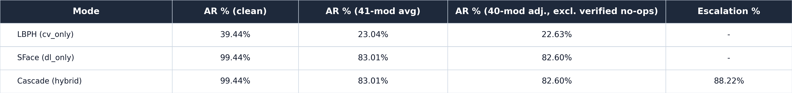
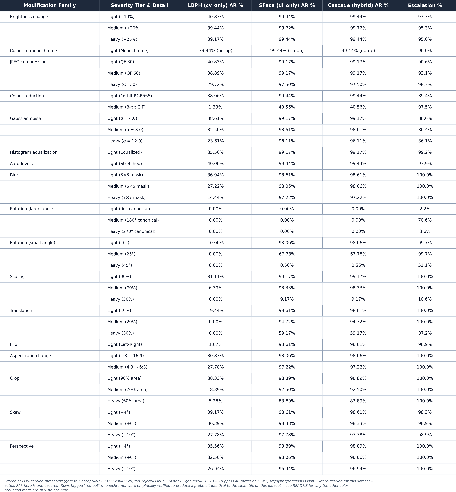

# AT&T/ORL faces identification robustness — a second, independent controlled-dataset test

*2026-08-02. Full 1-to-N gallery/probe-disjoint identification run
(`src/benchmark/accuracy_ratio_hybrid.py`), same protocol shape as the LFW2
identification run
([`docs/experiments/hybrid-identification/README.md`](../hybrid-identification/README.md))
and the La Salle DB1 run
([`docs/experiments/lasalle-db1-identification/README.md`](../lasalle-db1-identification/README.md)),
built fresh for the **AT&T/ORL faces database** (40 identities `s1`..`s40`,
10 images each, 92x112 8-bit grayscale `.pgm`,
`classical-cv/data/att_faces/`). Fresh split manifest, fresh enrollment,
fresh model directory — no LFW or La Salle artifacts reused. Scored on the
canon LFW-derived thresholds (`tau_accept=67.03325520645528`,
`tau_reject=140.13`, SFace `l2_genuine=1.0313`), not re-derived for this
dataset. YuNet detection on this dataset was verified 400/400 (100%) earlier
this session — no detector-failure confound.

## Summary table



| Mode | AR % (clean) | AR % (41-mod avg) | AR % (40-mod adj., excl. verified no-ops) | Escalation % |
|---|---:|---:|---:|---:|
| LBPH (`cv_only`) | 39.44% | 23.04% [22.37-23.73] | 22.63% | — |
| SFace (`dl_only`) | 99.44% | 83.01% [82.40-83.61] | 82.60% | — |
| Cascade (hybrid) | 99.44% | 83.01% [82.40-83.61] | 82.60% | 88.22% (range 2.22-100%) |

Pooled 95% Wilson CIs in brackets. Escalation `—` for `cv_only`/`dl_only`:
the concept doesn't apply to a single-engine mode, not the same as 0%. The
"40-mod adjusted" column excludes `monochrome` only (the sole verified true
no-op on this dataset — see below), NOT all three color-family mods as the
task brief originally assumed.

## Run configuration

- Split manifest: `data/splits/att_faces_ident_split_seed42.json` (built by
  `scripts/utils/make_controlled_ident_split.py`, schema
  `lsface-controlled-ident-split-v1`, shared script with La Salle DB1) — 1
  gallery image per identity (seeded `random.Random(42)` choice among the 10
  `.pgm` files), the remaining **9** images per identity as probes, ALL 40
  identities, no subsetting. `triples_sha256
  eab5425ef5b9d084ad55e8c84d48b546bbd71946482db3ab6a28b1c66da104c8`. Counts:
  40 identities, 40 gallery, 360 probes, no singletons/demoted (every
  identity has all 10 files).
- Enrollment: `scripts/pipeline/enroll_att_faces.py`, modeled directly on
  `ensure_lfw2_enrollment` in `scripts/pipeline/run_lfw2_robustness.py` —
  same LBPH hyperparameters (`radius=1, neighbors=8, grid_x=8, grid_y=8`) and
  the same YuNet + SFace enrollment path, pointed at the manifest above.
  Artifacts in `models/att_faces/` (never touches `models/lfw2/` or
  `models/lasalle_db1/`):
  `lbph_seed42_manifest73feed87f052_boxcrop.yml` /
  `lbph_labels_..._boxcrop.json` / `sface_gallery_..._boxcrop.npy` /
  `sface_labels_..._boxcrop.json`. 0 YuNet misses on the 40 gallery images.
- **Crop mode: `--lbph-assume-cropped false`.** ORL frames are not pre-cropped
  tiles the way `data/lasalle_db1_processed` is — YuNet detects a real face
  box inside the 92x112 frame (verified 400/400 this session). `false` is the
  crop-matched choice against the LFW-derived `tau_accept`, which was itself
  measured on YuNet **box-cropped** LBPH tiles (`cv-repo-map` §3.1: cropped
  vs full-frame differ by ~67.03 vs ~74.64 raw distance) — using `true` here
  would compound an already-unmeasured-FAR threshold mismatch with a second,
  avoidable one.
- `--mod-set dl41` (default), all 41 modifications, `--headline-scope all41`.
- `--no-face-policy strict`: a detection failure counts as a genuine system
  failure, not a skip (correct for a headline number, `cv-repo-map` §3B).
- All three modes (`cv_only`, `dl_only`, `cascade`), `--reuse-engine-scores`
  (AR/escalation run, not a latency run — ~3x less compute; see "Latency" below).
- Full raw output:
  `classical-cv/outputs/benchmark/att_faces_identification/accuracy_ratio_hybrid.{json,md}`,
  per-probe battery CSV in the same directory.

## Threshold caveat

`gate.tau_accept=67.03325520645528`, `gate.tau_reject=140.13`, SFace
`l2_genuine=1.0313` are all derived on LFW1 (10 ppm FAR target,
`src/hybrid/thresholds.json`). They are used here **as-is, frozen**, not
re-derived for AT&T/ORL — re-deriving per-dataset thresholds is a separate,
larger independence-test project, out of scope for this run. Actual FAR on
this dataset at these thresholds is unmeasured. This caveat is also baked
into both exported PNG table captions (not just this prose), since captions
travel with the image into the paper and prose next to it may not.

## Latency

Not measured for this run — no isolated single-process latency benchmark was
performed. The summary table's latency column reads `N/A`.

## Per-modification table



Full breakdown (17 families / 41 dl41 variants, `light`/`medium`/`heavy`
tiers). Detector-canonical `rot_90/180/270` are 0.00% AR for every mode
(same YuNet-can't-find-a-rotated-face effect as LFW2/La Salle); `rot_180`
still escalates 70.6% of the time even though nothing gets accepted (the gate
still fires on the samples where SOME face is detected at that angle before
the accept/reject rule rejects it — escalation and acceptance are separate
decisions). `flip_lr` mostly detects fine but scores near-zero on LBPH
(1.67%) because a mirrored face is a genuinely different LBPH texture
signature against a non-mirror-augmented single-image gallery.

## Correction to the task's "3 no-op modifications" premise — checked, not assumed

The task brief for this run stated that `monochrome`, `color_8bit`, and
`rgb565` are documented no-ops on grayscale input and should all be excluded
from an unannotated headline mean. **This was checked empirically before
building any table, and only `monochrome` holds:**

```
img = cv.imread("data/att_faces/s1/1.pgm")   # ndim=3, shape=(112, 92, 3)
monochrome: identical to clean (max abs diff = 0)
color_8bit: NOT identical (max abs diff = 42)
rgb565:     NOT identical (max abs diff = 5)
```

The mechanism: `load_probes_from_manifest` in `accuracy_ratio_hybrid.py`
reads every probe with plain `cv.imread(path)` = `IMREAD_COLOR`, which
promotes an 8-bit grayscale `.pgm` to a 3-channel array with three identical
channels *before* any modification runs. `src/benchmark/modifications.py`'s
`_is_color(img)` checks `img.ndim == 3` — true here, even though the
original source pixels only ever carried one channel of information — so the
"no-op if already gray" early-return in `_color_reduce` (backing
`color_8bit`/`rgb565`) never fires. `_color_reduce` then quantizes each of
the three (numerically identical) channels to a *different* bit depth
(`color_8bit` = 3-3-2 bpp, `rgb565` = 5-6-5 bpp), which makes the channels
diverge from each other — a real, if visually subtle, posterization
artifact, not a no-op. Per-modification numbers confirm this: `color_8bit`
clean-equivalent AR craters to 1.39%/40.56% (cv/dl) vs `monochrome`'s
39.44%/99.44%, which is numerically identical (to the last decimal place) to
the light-tier neighbors around it — `monochrome`'s early-return check is
`_is_color(img)` too, but averaging three identical channels back to one
gray value is mathematically a true identity operation regardless of how
many (identical) channels arrived, unlike bit-depth quantization.

**Consequence for this table:** only `monochrome` is tagged `(no-op)` and
excluded from the "40-mod adjusted" headline column; `color_8bit` and
`rgb565` are reported as ordinary, real modifications (they are — the numbers
above show real degradation, especially `color_8bit`). This is a
dataset/loader-interaction finding specific to grayscale-sourced images run
through this color-preserving probe path, not a general claim about the
`dl41` suite — it does not apply to the La Salle DB1 run, whose source images
are real full-color `.jpg`s throughout.

## Complementarity battery

- **Clean probes (n=360):** w/x/y/z (both-right / LBPH-only-right /
  SFace-only-right / both-wrong) = 142 / 0 / 216 / 2. Recovery
  P(SFace right | LBPH wrong) = 99.08% [96.72-99.75], both-fail = 0.56%
  [0.15-2.00] — the lowest both-fail ceiling of any run in this trio (La
  Salle DB1: 7.47% clean; LFW2: much higher).
- **Modified probes (14,760 = 360 x 41):** w/x/y/z = 3,400 / 1 / 8,853 /
  2,506. Recovery = 77.94% [77.17-78.69], both-fail = 16.98% [16.38-17.59].
  McNemar x=1 vs y=8,853, p_exact ≈ 0 — still overwhelmingly one-directional
  (LBPH uniquely rescues SFace on exactly 1 of 14,760 modified probes).
- Gate competence: ROC AUC(LBPH distance -> "LBPH wrong") = 1.000.
- Detector-canonical AR (`rot_90/180/270`, `flip_lr`): cv_only 0.42%,
  dl_only/cascade 24.65%.

## The upscale caveat

`normalize_face(face_gray, img_size=IMG_SIZE)` in
`src/classical_faces/preprocess.py` resizes every detected face box to
100x100 regardless of its native size. ORL's source frames are only 92x112 —
smaller than LFW's typically-larger crops — so the YuNet-detected face box
inside them is smaller still, and this run's LBPH tiles are genuinely
**upscaled**, not downscaled, before histogram extraction. This is a real,
dataset-specific interpolation artifact (soft/blocky edges from upsampling a
small source) that the other two runs in this trio (LFW2, La Salle DB1) don't
share to the same degree — La Salle DB1's `100x100` source tiles need no
resize at all, and LFW's 250x250 raw frames yield a face box closer to or
larger than 100x100 before crop. Not deeply investigated further here (one
caveat line, per task scope) — flagged as a plausible contributor to LBPH's
texture signal being noisier on this dataset than a "more controlled = better
LBPH" story alone would predict, though the summary numbers below show LBPH
still does comparatively well here despite it.

## Does this support or complicate the "LBPH does better on controlled data" hypothesis?

[`docs/NOTES.md`](../../NOTES.md): *"LBPH passed the algorithm test because
the LSDB ... was more controlled."*

**This run gives the clearest support for the hypothesis of the three.**
LBPH's clean AR here (39.44%) is an order of magnitude above both LFW2's
(2.26%) and La Salle DB1's fresh-split number (8.44%); its 41-mod overall AR
(23.04%, or 22.63% on the adjusted 40-mod headline) is likewise far above
LFW2's 1.41% and La Salle DB1's 3.71%. Clean Rank-1 (65.56%, threshold-free)
shows the effect isn't purely a threshold artifact either — LBPH's raw
*ranking* ability is genuinely much stronger on ORL's small, uniform,
studio-lit, frontal-pose dataset than on either LFW2's wild photos or La
Salle DB1's stark dark/light pose-crossed split.

The likely reason ORL helps LBPH more than La Salle DB1's fresh split does
(even though both are "controlled" datasets): ORL's 10 images per identity
vary mildly in expression/pose/accessories under a **single, roughly
consistent lighting setup** and a uniform dark background — the classic ORL
design — so a single gallery image is a reasonably representative texture
sample of the other 9. La Salle DB1's fresh split crosses a full
`dark`/`light` illumination change with only one enrolled reference per
identity (see the La Salle DB1 README for detail), which is a much larger
appearance swing for LBPH's histogram to bridge. So the hypothesis holds, but
with an important qualifier: it's not "controlled dataset" as a binary
property that helps LBPH, it's specifically **low intra-identity appearance
variation relative to what the single gallery image covers** — a dimension
ORL happens to score well on and this La Salle DB1 split happens to score
poorly on, despite both being conventionally described as "controlled."
Even at its best (ORL), though, LBPH's 41-mod AR (23.04%) remains far below
SFace's (83.01%) and below the literature's 65-75% classical-baseline range
for 1:1 verification-style setups (a different protocol — see
`robustness-protocol-map` §0/§4 for why 1-to-N identification AR at a 10 ppm
gate is not directly comparable to that literature figure either).

## Cross-references

- [`docs/experiments/lasalle-db1-identification/README.md`](../lasalle-db1-identification/README.md) —
  the paired controlled-dataset run (La Salle DB1), same protocol shape.
- [`docs/experiments/hybrid-identification/README.md`](../hybrid-identification/README.md) —
  the LFW2 (wild) identification run both controlled-dataset runs are compared against.
- [`docs/NOTES.md`](../../NOTES.md) — the "LBPH does better on controlled
  data" hypothesis this run tests.
- `classical-cv/data/splits/att_faces_ident_split_seed42.json` — the split manifest.
- `classical-cv/scripts/utils/make_controlled_ident_split.py` — manifest builder (shared with La Salle DB1).
- `classical-cv/scripts/pipeline/enroll_att_faces.py` — enrollment script.
- `classical-cv/scripts/export_controlled_identification_tables.py` — table exporter (shared with La Salle DB1).
- `classical-cv/outputs/benchmark/att_faces_identification/accuracy_ratio_hybrid.{json,md}` — full raw output.
