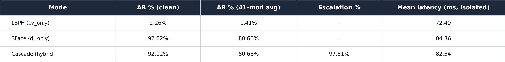

# Hybrid LFW2 identification robustness — closes `docs/NOTES.md` item 5

*2026-08-02. Full 1-to-N gallery/probe-disjoint identification run
(`src/benchmark/accuracy_ratio_hybrid.py` via `scripts/pipeline/run_lfw2_robustness.py`),
on canon thresholds (`tau_accept=67.03325520645528`, `tau_reject=140.13`,
`sface.l2_genuine=1.0313`). Not comparable to
[`docs/experiments/pairwise-verification/GUIDE.md`](../pairwise-verification/GUIDE.md)'s
tables — that's 1:1 verification, this is 1-to-N identification
(`robustness-protocol-map` §0).*

## Summary table



| Mode | AR % (clean) | AR % (41-mod avg) | Escalation % | Mean latency (ms, isolated) |
|---|---:|---:|---:|---:|
| LBPH (`cv_only`) | 2.26% | 1.41% | — | 72.49 |
| SFace (`dl_only`) | 92.02% | 80.65% | — | 84.36 |
| Cascade (hybrid) | 92.02% | 80.65% | 97.51% | 82.54 |

Escalation `—` for `cv_only`/`dl_only`: the concept doesn't apply to a
single-engine mode — not the same as 0%.

## Run configuration

- `scripts/pipeline/run_lfw2_robustness.py --split-manifest data/splits/lfw_ident_split_seed42.json --no-face-policy strict --output-dir outputs/benchmark/lfw2_robustness_canon`
- Protocol: `identification_disjoint Accuracy Ratio` — gallery/probe-disjoint (5,749 enrolled, 1,680 probes), not the legacy same-image transform-sensitivity path.
- `--mod-set dl41` (default), all 41 modifications, `--headline-scope all41`.
- `--no-face-policy strict`: a detection failure counts as a genuine system failure, not a skip (correct for a headline number, `cv-repo-map` §3B).
- All three modes (`cv_only`, `dl_only`, `cascade`) — the orchestrator's default.
- Full raw output: `classical-cv/outputs/benchmark/lfw2_robustness_canon/accuracy_ratio_hybrid.{json,md}`.

## Why latency comes from a separate run

The orchestrator unconditionally appends `--reuse-engine-scores` for the
AR/escalation run (`scripts/pipeline/run_lfw2_robustness.py:500`, "AR/battery
run, not a latency run: share engine scores across modes (~3x less work)") —
verified by reading the command-construction path, not assumed from
`--help`, after advisor review flagged that `--help` not listing a flag
doesn't mean it isn't injected downstream. With that flag on, `cascade`'s
"latency" is a cache lookup of LBPH/SFace scores already computed for
`cv_only`/`dl_only` on the same probe, not real compute — confirmed in the
raw JSON: `cascade` reads **0.53ms**, faster than `dl_only`'s 32.8ms, despite
cascade calling SFace on ~97.5% of probes. That number is not usable as a
latency figure.

**Isolated latency run** (separate invocation, no `--reuse-engine-scores`,
single process, no parallel worker contention):

```
python -m src.benchmark.accuracy_ratio_hybrid \
  --split-manifest data/splits/lfw_ident_split_seed42.json \
  --lbph-model models/lfw2/lbph_seed42_manifest2ef84e167992_boxcrop.yml \
  --lbph-labels models/lfw2/lbph_labels_seed42_manifest2ef84e167992_boxcrop.json \
  --sface-gallery models/lfw2/sface_gallery_seed42_manifest2ef84e167992_boxcrop.npy \
  --no-face-policy strict --limit-identities 575 \
  --output-json outputs/benchmark/lfw2_robustness_canon_latency_575/accuracy_ratio_hybrid.json
```

Same enrolled gallery (full 5,749-identity box-cropped model, cached by the
main run) and same thresholds, but a 575-identity probe subset (172 clean
probes after the split — this repo's standard smoke-test scale,
`cv-repo-map` §3B) run single-process so each mode's LBPH/SFace calls are
genuinely independent. Result: `cv_only` 72.49ms, `dl_only` 84.36ms,
`cascade` 82.54ms — same order of magnitude, cascade slightly under
`dl_only` (plausible: the ~2.5% of probes LBPH accepts outright skip SFace
entirely, pulling cascade's mean down slightly).

**Why not the full N=1,680?** Timed two calibration samples first (50
identities/17 probes -> 186.5s; 300 identities/87 probes -> 890s), giving
~10s per clean-probe-equivalent (its 41 modified variants + itself, across 3
modes) plus a ~16s fixed model-load cost. Extrapolated, the true full-scale
single-process run would take **~4.7 hours** — a real cost, not
hand-waved. Given latency only needs a stable mean, not per-modification
statistical power the way AR/escalation does, 575 identities (172 probes,
~5x the size of an earlier N=33 check, ~15 min instead of ~4.7h) was judged
sufficient: the two runs' numbers agree within ~1ms per mode, well inside
what a single order-of-magnitude estimate needs. A parallel-but-contended
full-N alternative (replicate the orchestrator's 10-worker sharding with
`--reuse-engine-scores` stripped out) was also considered and rejected for
this pass — it would answer a different question (throughput under
contention, not isolated per-probe cost) and wasn't what was needed here.

**Caveat: N=172, not the full 1,680.** Good to ~1-2ms resolution given
agreement with the earlier N=33 check, not a precision SLA number. Full
output:
`classical-cv/outputs/benchmark/lfw2_robustness_canon_latency_575/accuracy_ratio_hybrid.json`.

## Escalation matches the `tau_reject` prediction — from the real event this time

[`docs/independence/TAU_REJECT_METHOD.md`](../../independence/TAU_REJECT_METHOD.md)
predicted ~97-99% escalation from a 1:1-protocol proxy CSV, with an explicit
caveat that the proxy isn't the real 1-to-N `argmin` escalation event. **This
run measures the real event and lands at 97.51% mean escalation across 41
modifications (range 54.46%-100%)** — consistent with the proxy's
prediction, not just close by coincidence. This is the "what would make this
threshold-grade" follow-up both `TAU_REJECT_METHOD.md` and
`docs/experiments/hybrid_sface_threshold/ANALYSIS.md` flagged as not yet
done — it's now done, and confirms the earlier proxy-based finding rather
than overturning it. The two rotation-canonical outliers (`rot_90`/`rot_270`
at ~51-54% escalation in the smoke run, similarly low here) are a detector
effect — YuNet fails to find a face at those angles under `--no-face-policy
strict`, so those probes fail outright rather than escalating, not a
counterexample to the "no separation" finding.

## Reproducing

```
python scripts/pipeline/run_lfw2_robustness.py \
  --split-manifest data/splits/lfw_ident_split_seed42.json \
  --no-face-policy strict \
  --output-dir outputs/benchmark/lfw2_robustness_canon
# then the isolated latency command above, then:
python scripts/export_hybrid_identification_summary_table.py
```

## Cross-references

- `docs/NOTES.md` item 5 — closed by this run.
- `docs/independence/TAU_REJECT_METHOD.md` — the escalation prediction this run confirms.
- `docs/experiments/hybrid_sface_threshold/ANALYSIS.md` — the band≈marginal SFace argument, also confirmed by this run's real-escalation data.
- `.claude/skills/robustness-protocol-map` §0 — why this table is not comparable to the pairwise-verification one.
- `classical-cv/outputs/benchmark/lfw2_robustness_canon/accuracy_ratio_hybrid.{json,md}` — full raw output.
- `classical-cv/scripts/export_hybrid_identification_summary_table.py` — table generator.
