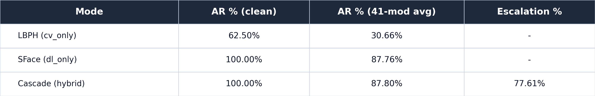
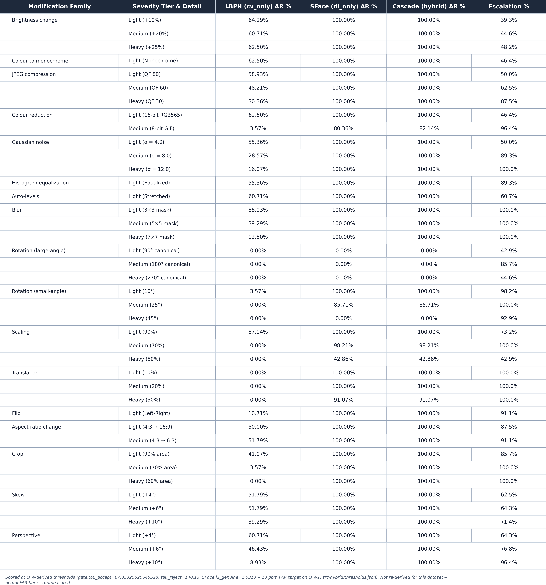

# La Salle DB1 identification robustness (clean10) — the DATASET_MATRIX-optimal training recipe

*2026-08-02. Same protocol shape as
[`lasalle-db1-identification/`](../lasalle-db1-identification/README.md)
(1-to-N gallery/probe-disjoint identification,
`src/benchmark/accuracy_ratio_hybrid.py`), rerun on La Salle DB1 with a
**different gallery composition**: the training-data recipe
`classical-cv/docs/reports/DATASET_MATRIX.md` found optimal for LBPH —
10 gallery images per identity (5 `light_*` + 5 `dark_*` poses:
front/up/down/left/right), holding out `light_name` + `dark_name` as the 2
probes per identity. This is the same "clean" recipe DATASET_MATRIX
recommends and that `docs/PAPER.md`'s existing 10-gallery/2-probe La Salle
result already uses — rebuilt fresh here under the gallery/probe-disjoint
identification protocol and the unified LFW-derived thresholds, neither of
which DATASET_MATRIX's or PAPER.md's own runs used.**

**This is a separate results table from
[`lasalle-db1-identification/`](../lasalle-db1-identification/README.md)
(the 1-gallery/11-probe run), not a replacement.** Both stay published; this
one isolates what changing gallery composition alone does, holding dataset,
threshold, protocol, and crop mode fixed.

## Why DATASET_MATRIX.md and not `data/split_lasalle`

`DATASET_MATRIX.md`'s own artifact, `data/split_lasalle`, has rotted since it
was written (June 12, 2026): verified 2026-08-02, `train/` has only 10 of 28
identity folders with 1 file each, `test/` has 14 empty folders. Unusable.
The 10-gallery/2-probe **recipe** (which poses, which split) is still fully
specified in the doc's prose and Table §1, so this run rebuilds it from
scratch against the intact `data/lasalle_db1_processed` (28 × 12, verified
uniform filenames across all 28 identities) rather than reusing the decayed
folder — same composition, freshly split
(`scripts/utils/make_lasalle_clean10_split.py`).

## Summary table

| Mode | AR % (clean) | AR % (41-mod avg) | Escalation % |
|---|---:|---:|---:|
| LBPH (`cv_only`) | 62.50% [49.41-73.99] | 30.66% [28.81-32.58] | — |
| SFace (`dl_only`) | 100.00% [93.58-100.0] | 87.76% [86.36-89.04] | — |
| Cascade (hybrid) | 100.00% [93.58-100.0] | 87.80% [86.40-89.08] | 77.61% (range 39.29-100.0%) |

Pooled 95% Wilson CIs in brackets. Escalation `—` for `cv_only`/`dl_only`:
the concept doesn't apply to a single-engine mode.

## The prediction this run was set up to test, and the result

The paired 1-gallery/11-probe run's own README concluded LBPH's weakness
there was substantially about enrollment coverage: a single (pose, lighting)
gallery image can't match probes from the *opposite* lighting condition,
which LBPH's texture histogram is far more sensitive to than SFace's learned
embedding. That predicts a substantial LBPH jump once the gallery covers
**both** real lighting conditions (DATASET_MATRIX's own finding: single-light
training caps LBPH at 89.29% cross-lighting rank-1, both-lighting reaches
100%). Writing the prediction down before running, so this cuts both ways:

**The prediction held, and by a wide margin.** LBPH clean AR: 8.44% -> 62.50%
(~7.4x); clean Rank-1: 21.75% -> 100.00% (every identity's nearest gallery
match is now correct — the ranking problem is fully solved by
enrollment coverage alone). 41-mod overall AR: 3.71% -> 30.66% (~8.3x);
41-mod Rank-1: 16.08% -> 71.52%. This is a real, large, mechanistically
expected effect — not noise (56-probe clean AR CI [49.4-74.0] and the old
run's CI [3.40-4.06] on 308 probes don't overlap even loosely once scaled to
the new run's own [28.8-32.6] 41-mod CI).

**Read LBPH's numbers as the finding — SFace/Cascade movement here is not
a like-for-like comparison** (see next section). LBPH is the only engine
whose training-side variable actually changed between the two runs.

## LBPH multi-shot vs SFace single-shot — why only LBPH is comparable across the two runs

LBPH trained on all 10 gallery images/identity (true multi-shot: 280
templates). SFace's gallery has always overwritten per-identity on repeated
entries (last-wins) — rather than let "whichever image happens to load last"
silently decide the SFace reference, this run fixes it explicitly:
**every identity's SFace embedding is `light_front.jpg`, deterministically**
(`scripts/pipeline/enroll_lasalle_db1_clean10.py`, `SFACE_REFERENCE_POSE`).
So:

- **LBPH old -> new is a real, isolated multi-shot comparison**: both runs
  score against the same 28 identities, same thresholds, same crop mode; only
  the gallery composition (1 random pose vs 10 poses spanning both lighting
  conditions) changed.
- **SFace/Cascade old -> new is NOT the same comparison.** The old run
  enrolled a seeded-random single pose (`random.Random(42)` pick per
  identity); this run enrolls a fixed `light_front` pose. SFace clean AR
  moved 92.53% -> 100.00% and 41-mod AR moved 76.88% -> 87.76% — some or all
  of that movement is which single reference image SFace got, not a change
  in SFace's own robustness. SFace was never multi-shot in either run; this
  document does not claim SFace improved, only that its reference image
  changed. Since SFace already saturates or near-saturates in both runs, the
  practical effect on the paper's headline (LBPH can't gate wild/thin-gallery
  data, cascade leans on SFace) is unaffected either way.

## Run configuration

- Split manifest: `data/splits/lasalle_db1_ident_split_clean10_seed42.json`
  (built by `scripts/utils/make_lasalle_clean10_split.py`, schema
  `lsface-controlled-ident-split-v1` — `gallery` is a **list** of 10 relpaths
  per identity here, not the single-string field the original split used;
  `load_gallery_from_manifest` in `accuracy_ratio_hybrid.py` was extended to
  accept either shape). Deterministic pose-based split (no RNG): gallery =
  `{light,dark}_{front,up,down,left,right}`, probes = `light_name` +
  `dark_name`. Counts: 28 identities, 280 gallery images, 56 probes.
  `triples_sha256 42de230ef25efcd1846a5c05b9bb1eb0e016b1cc3222d8716b91c2e909d130a3`.
- Enrollment: `scripts/pipeline/enroll_lasalle_db1_clean10.py`. Same LBPH
  hyperparameters as every other track in this repo
  (`radius=1, neighbors=8, grid_x=8, grid_y=8`), same YuNet + SFace path.
  Fixes a real bug present in the copied-from template
  (`ensure_lfw2_enrollment` / `enroll_lasalle_db1.py`'s
  `label_map[person] = len(label_map)` inside the per-image loop, which
  silently corrupts multi-shot enrollment by reassigning a person's label on
  every repeated occurrence while earlier LBPH templates keep the orphaned
  old label) — this script pre-builds `label_map` once from the full sorted
  identity list before the loop, matching the pattern
  `enroll_lfw_multishot.py` already used correctly. 280 LBPH templates
  trained (10.0/identity, confirmed), 1 YuNet miss (whole-tile fallback, same
  graceful handling as every other enrollment script here). Artifacts in
  `models/lasalle_db1_clean10/` (never touches `models/lasalle_db1/` or
  `models/lfw2/`).
- **Crop mode: `--lbph-assume-cropped true`**, same as the paired run — only
  gallery composition changed, not crop mode (changing both would confound
  the one variable this run isolates).
- `--mod-set dl41` (default), all 41 modifications, `--headline-scope all41`,
  `--no-face-policy strict`, all three modes, `--reuse-engine-scores`.
- Full raw output:
  `classical-cv/outputs/benchmark/lasalle_db1_identification_clean10/accuracy_ratio_hybrid.{json,md}`,
  per-probe battery CSV in the same directory.

## Threshold caveat (unchanged from every other track)

`gate.tau_accept=67.03325520645528`, `gate.tau_reject=140.13`, SFace
`l2_genuine=1.0313` — LFW1-derived, 10 ppm FAR target, used as-is, not
re-derived for this dataset or this gallery composition. **Do not substitute
DATASET_MATRIX.md's own `thr@100ppm=73.04`** — that number targets a
different FAR budget (100 ppm vs 10 ppm), a different protocol (1:1
verification TAR vs this run's 1-to-N identification AR), and a different
crop convention; mixing it in would be exactly the threshold-family error
`cv-repo-map` §3.1 warns against. Actual FAR on La Salle DB1 at the frozen
thresholds is unmeasured. Baked into both PNG captions, not just this prose.

## Granularity caveat

56 clean probes (28 identities × 2 held-out poses) gives coarse Wilson CIs
on the clean row (±~12pp half-width here) — much wider than the paired run's
308-probe clean CIs. The 41-mod pooled row (2,296 probe-modification pairs)
is fine-grained. Don't compare this run's clean-column point estimate to
another track's clean column as if both carried the same precision; the
bracketed CI is the number to actually compare.

## Per-modification table

Same 17-family/41-variant layout as every other identification track. LBPH
now clears 50-65% AR on most light/medium modifications (vs single digits to
low-40s in the 1-gallery run) — brightness, monochrome, JPEG-light,
histogram/auto-level, light blur, light/medium skew and perspective all sit
in the 50-65% band. LBPH still collapses to 0% on: the three
detector-canonical large-angle rotations (YuNet can't find a rotated face —
same effect as every other track, not a recognition failure) and several
heavy geometric distortions (medium/heavy crop, all three translation
tiers, heavy scaling) where the *detected* face box itself shifts enough
that even a 10-image gallery's LBPH template stops matching. `color_8bit`
(medium colour reduction) is still LBPH's single worst non-canonical cell
(3.57% AR) — consistent with the paired run and with the ORL run's finding
that this modification is a genuine, non-trivial degradation on this
pipeline's `IMREAD_COLOR`-first loading path, not a documented no-op.

## Complementarity battery

- **Clean probes (n=56):** w/x/y/z (both-right / LBPH-only-right /
  SFace-only-right / both-wrong) = 35 / 0 / 21 / 0. Recovery
  P(SFace right | LBPH wrong) = 100.00% [84.54-100.0], both-fail = 0.00%
  [0.00-6.42] — on clean probes, every LBPH miss is recovered by SFace, and
  neither engine has an unrecoverable clean failure. McNemar b=0 vs c=21,
  p_exact ≈ 9.5e-6.
- **Modified probes (2,296 = 56 × 41):** w/x/y/z = 703 / 1 / 1,312 / 280.
  Recovery = 82.41% [80.46-84.20], both-fail (the ceiling no fusion beats) =
  12.20% [10.92-13.60]. McNemar b=1 vs c=1,312, p_exact ≈ 0 — the rescue is
  still overwhelmingly one-directional (SFace recovers LBPH's misses), with
  a single exception case (1 probe where LBPH alone was right) that didn't
  exist in the 1-gallery run.
- Detector-canonical AR (`rot_90/180/270`, `flip_lr`): cv_only 2.68%,
  dl_only/cascade 25.00% — same structural pattern as the paired run (driven
  by the three 0%-AR canonical rotations), lower than the headline 41-mod
  mean.

## Comparison table: 1-gallery/11-probe vs clean10 (this run)

| Metric | 1-gallery/11-probe (old) | clean10 (this run) | Change |
|---|---:|---:|---:|
| LBPH clean AR | 8.44% | 62.50% [49.41-73.99] | ~7.4x |
| LBPH clean Rank-1 | 21.75% | 100.00% | +78.25pp |
| LBPH 41-mod AR | 3.71% [3.40-4.06] | 30.66% [28.81-32.58] | ~8.3x |
| LBPH 41-mod Rank-1 | 16.08% | 71.52% | +55.44pp |
| SFace/Cascade clean AR | 92.53% | 100.00% [93.58-100.0] | not comparable — see above (reference-pose change, not a robustness change) |
| SFace/Cascade 41-mod AR | 76.88% [76.14-77.61] | 87.76-87.80% [86.36-89.08] | not comparable — see above |
| Cascade escalation (mean) | 91.34% (range 34.09-99.68%) | 77.61% (range 39.29-100.0%) | lower mean — LBPH now clears `tau_accept` outright on more probes, so fewer need escalation |

## Does this change the paper's headline conclusion?

**No — it sharpens the mechanism, it doesn't overturn the conclusion.** The
project's headline (LBPH can't gate wild, single-shot enrollment; cascade
leans on SFace) was always scoped to the **single-gallery-image** enrollment
LFW2 uses, because that's what a real "one photo at signup" deployment looks
like. This run confirms *why* that specific scenario is hard for LBPH
(enrollment coverage, not an intrinsic LBPH/dataset ceiling) and shows the
fix (more gallery images spanning real appearance variation) works — exactly
as DATASET_MATRIX.md already found for the verification protocol. It does
not change what the system does under the deployment assumption the paper
actually reports against (1 gallery image, wild population): LBPH still
needs help there, SFace still carries the cascade. This run is evidence for
an *enrollment-procedure* recommendation (capture multiple lighting
conditions per person if the deployment can support it), not a retraction of
the single-shot finding.

## Cross-references

- [`lasalle-db1-identification/README.md`](../lasalle-db1-identification/README.md) —
  the paired 1-gallery/11-probe run this compares against.
- `classical-cv/docs/reports/DATASET_MATRIX.md` — the source of the 10-image,
  5-light+5-dark training recipe used here; also documents the
  single-lighting-training cross-lighting failure this run's prediction was
  based on.
- [`hybrid-identification/README.md`](../hybrid-identification/README.md) —
  the LFW2 (wild, single-shot) identification run — the scenario this run's
  headline conclusion still applies to unchanged.
- `classical-cv/data/splits/lasalle_db1_ident_split_clean10_seed42.json` — the
  split manifest.
- `classical-cv/scripts/utils/make_lasalle_clean10_split.py` — manifest builder (new, deterministic pose-based).
- `classical-cv/scripts/pipeline/enroll_lasalle_db1_clean10.py` — enrollment script (new; fixes the label_map bug, deterministic SFace reference).
- `classical-cv/scripts/export_controlled_identification_tables.py` — table exporter (shared, unmodified).
- `classical-cv/outputs/benchmark/lasalle_db1_identification_clean10/accuracy_ratio_hybrid.{json,md}` — full raw output.
