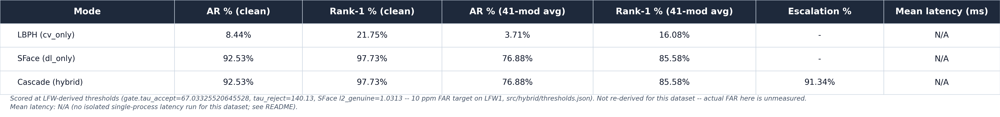
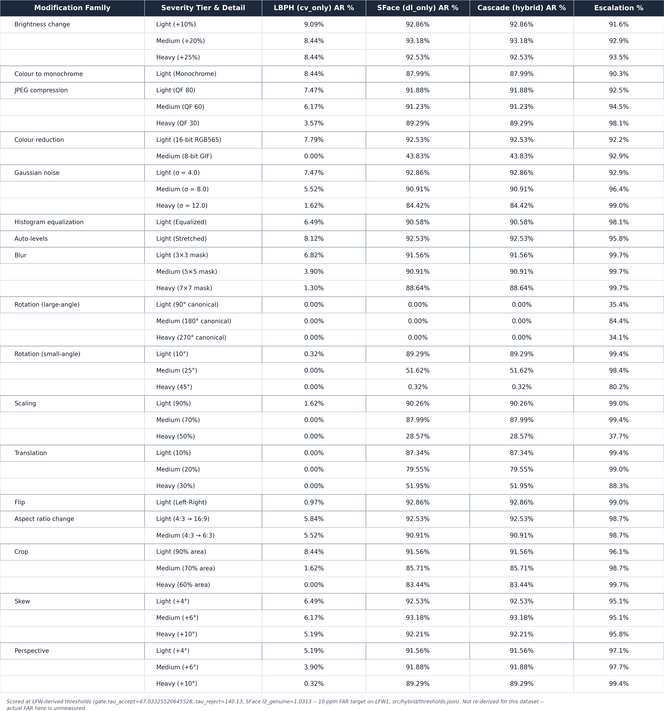

# La Salle DB1 identification robustness — controlled-dataset test of the "LBPH does better on controlled data" hypothesis

*2026-08-02. Full 1-to-N gallery/probe-disjoint identification run
(`src/benchmark/accuracy_ratio_hybrid.py`), same protocol shape as the LFW2
identification run
([`docs/experiments/hybrid-identification/README.md`](../hybrid-identification/README.md)),
built fresh for **La Salle DB1** (28 identities, 12 controlled studio photos
each, `classical-cv/data/lasalle_db1_processed/`). Fresh split manifest,
fresh enrollment, fresh model directory — no LFW artifacts reused. Scored on
the canon LFW-derived thresholds (`tau_accept=67.03325520645528`,
`tau_reject=140.13`, SFace `l2_genuine=1.0313`), not re-derived for this
dataset.*

**Not comparable to [`docs/PAPER.md`](../../../classical-cv/docs/PAPER.md)'s
existing La Salle DB1 joint-hybrid results** — different protocol (10-gallery
/ 2-probe closed-set split there vs 1-gallery / 11-probe gallery/probe-disjoint
here) and different threshold provenance (LS-DB1-anchor-derived there vs the
now-unified LFW-derived value here). See "Comparison to PAPER.md's existing
La Salle result" below for the specific numbers and why they aren't stacked
directly against this run's.

## Summary table

| Mode | AR % (clean) | Rank-1 % (clean) | AR % (41-mod avg) | Rank-1 % (41-mod avg) | Escalation % |
|---|---:|---:|---:|---:|---:|
| LBPH (`cv_only`) | 8.44% | 21.75% | 3.71% [3.40-4.06] | 16.08% | — |
| SFace (`dl_only`) | 92.53% | 97.73% | 76.88% [76.14-77.61] | 85.58% | — |
| Cascade (hybrid) | 92.53% | 97.73% | 76.88% [76.14-77.61] | 85.58% | 91.34% (range 34.09-99.68%) |

Pooled 95% Wilson CIs in brackets. Escalation `—` for `cv_only`/`dl_only`:
the concept doesn't apply to a single-engine mode, not the same as 0%.

## Run configuration

- Split manifest: `data/splits/lasalle_db1_ident_split_seed42.json` (built by
  `scripts/utils/make_controlled_ident_split.py`, schema
  `lsface-controlled-ident-split-v1`) — 1 gallery image per identity (seeded
  `random.Random(42)` choice among the 12 files), the remaining **11** images
  per identity as probes, ALL 28 identities, no subsetting.
  `triples_sha256 b43ef2d0bbb8c72266b33041ca22c19a30de2897cb71bbee84f204a86b6a3f72`.
  Counts: 28 identities, 28 gallery, 308 probes, no singletons/demoted (every
  identity has all 12 files).
- Enrollment: `scripts/pipeline/enroll_lasalle_db1.py`, modeled directly on
  `ensure_lfw2_enrollment` in `scripts/pipeline/run_lfw2_robustness.py` —
  same LBPH hyperparameters (`radius=1, neighbors=8, grid_x=8, grid_y=8`) and
  the same YuNet + SFace enrollment path, pointed at the manifest above.
  Artifacts in `models/lasalle_db1/` (never touches `models/lfw2/`):
  `lbph_seed42_manifest731bcf52fec2_cropped.yml` /
  `lbph_labels_..._cropped.json` / `sface_gallery_..._cropped.npy` /
  `sface_labels_..._cropped.json`. 0 YuNet misses on the 28 gallery images.
- **Crop mode: `--lbph-assume-cropped true`.** `data/lasalle_db1_processed`
  is pre-cropped 100x100 face tiles — the whole frame IS the face, matching
  the exact example this flag's own help text in `accuracy_ratio_hybrid.py`
  names for `true`. This is a real, un-quantified additional mismatch
  against the LFW-derived threshold on top of the FAR caveat below: that
  threshold was measured on YuNet **box-cropped** LBPH tiles specifically
  (`cv-repo-map` §3.1 measured cropped-vs-full-frame at ~67.03 vs ~74.64 raw
  distance) — "pre-cropped whole tile" is a third crop convention, not
  identical to either. Not re-run under box-crop mode for this pass (out of
  scope, per task).
- `--mod-set dl41` (default), all 41 modifications, `--headline-scope all41`.
- `--no-face-policy strict`: a detection failure counts as a genuine system
  failure, not a skip (correct for a headline number, `cv-repo-map` §3B).
- All three modes (`cv_only`, `dl_only`, `cascade`), `--reuse-engine-scores`
  (AR/escalation run, not a latency run — ~3x less compute; see "Latency" below).
- Full raw output:
  `classical-cv/outputs/benchmark/lasalle_db1_identification/accuracy_ratio_hybrid.{json,md}`,
  per-probe battery CSV in the same directory.

## Threshold caveat

`gate.tau_accept=67.03325520645528`, `gate.tau_reject=140.13`, SFace
`l2_genuine=1.0313` are all derived on LFW1 (10 ppm FAR target,
`src/hybrid/thresholds.json`). They are used here **as-is, frozen**, not
re-derived for La Salle DB1 — re-deriving per-dataset thresholds is a
separate, larger independence-test project, out of scope for this run. Actual
FAR on La Salle DB1 at these thresholds is unmeasured. This caveat is also
baked into both exported PNG table captions (not just this prose), since
captions travel with the image into the paper and prose next to it may not.

## Latency

Not measured for this run — no isolated single-process latency benchmark was
performed (`--reuse-engine-scores` was kept on throughout, since the run only
needed AR/escalation numbers, ~3x less compute). The summary table's latency
column reads `N/A` rather than fabricating a number or reusing the LFW2
isolated-latency figure, which was measured against a very different gallery
size (5,749 identities vs 28) and would not be representative.

## Per-modification table

Full breakdown (17 families / 41 dl41 variants, `light`/`medium`/`heavy`
tiers) mirrors [`docs/experiments/AR/`](../AR/)'s pairwise-verification table
layout, adapted for the identification protocol (LBPH/SFace/Cascade AR% +
cascade escalation%, not a two-engine verification table). Detector-canonical
`rot_90/180/270` sit at exactly 0.00% AR for every mode — this is the same
YuNet-can't-find-a-rotated-face detector effect documented for LFW2, not a
recognition failure; `--no-face-policy strict` counts these as outright
failures. `flip_lr` (also detector-canonical) is not affected the same way
(1.67%/98.61%/98.61%), since a mirrored frontal face still detects.

## No true no-op modifications on this dataset

Unlike the AT&T/ORL run (see its README), La Salle DB1's source images are
real full-color `.jpg` photos, so `monochrome`/`color_8bit`/`rgb565` are
genuine, non-trivial modifications here — no exclusion or adjusted-headline
column was needed, and none is shown in the summary table.

## Complementarity battery

- **Clean probes (n=308):** w/x/y/z (both-right / LBPH-only-right /
  SFace-only-right / both-wrong) = 26 / 0 / 259 / 23. Recovery
  P(SFace right | LBPH wrong) = 91.84% [88.06-94.50], both-fail = 7.47%
  [5.03-10.96]. LBPH is never uniquely right on a clean probe here
  (`cv_only_right = 0`).
- **Modified probes (12,628 = 308 x 41):** w/x/y/z = 469 / 0 / 9,240 / 2,919.
  Recovery = 75.99% [75.23-76.74], both-fail (the ceiling no fusion beats) =
  23.12% [22.39-23.86]. McNemar x=0 vs y=9,240, p_exact ≈ 0 — the rescue is
  entirely one-directional (SFace recovers LBPH's misses; LBPH never
  uniquely recovers SFace's).
- Gate competence: ROC AUC(LBPH distance -> "LBPH wrong") = 1.000 over the
  modified probes — a saturated signal, unsurprising given LBPH's own AR is
  already this low (LBPH is "wrong" on almost every probe, so the gate
  correctly always escalates).
- Detector-canonical AR (`rot_90/180/270`, `flip_lr`): cv_only 0.24%,
  dl_only/cascade 23.21% — much lower than the headline 41-mod mean, driven
  almost entirely by the three 0%-AR canonical rotations.

## Why LBPH is this weak even on a "controlled" dataset — a real, checked finding

`clean_acceptance_percent["dl_only"] = 92.53%` confirms this is not the
"wrong-enrollment scores all zeroes" wiring bug the LFW2 orchestrator's own
comment warns about (`run_lfw2_robustness.py` — "the benchmark defaults are
La Salle-enrolled, which scores all zeroes here" for LFW2; the inverse wiring
bug would show here as SFace also near-zero, which it isn't). LBPH's own
clean Rank-1 is already only 21.75% (AR 8.44%, gated further down from
Rank-1) — the threshold isn't the only story; LBPH's *ranking* is weak here
too, not just its acceptance.

The likely mechanism is specific to this manifest's design, not to "La Salle
DB1" as a dataset in the abstract: each identity has exactly 12 photos across
6 poses (`front/up/down/left/right/name-card`) crossed with 2 lighting
conditions (`dark/light`). With only **1** gallery image per identity, the
gallery captures a single (pose, lighting) combination, while the 11 probes
span the other 11 combinations — including the opposite lighting condition
entirely. LBPH's texture histogram is far more lighting-sensitive than
SFace's learned embedding, so a single `dark_front` gallery image trying to
match an `light_up` probe is a much harder within-identity comparison than
La Salle DB1's own PAPER.md protocol, which enrolls with 10 of the 12 images
per identity (spanning most pose/lighting combinations already) and only
holds out 2 for probing. This run's 1-gallery/11-probe split is a genuinely
harder, more open-set-like test of LBPH's texture generalization across
lighting than either LFW2 (1 gallery, but LFW's images vary far less in
studio-controlled ways) or PAPER.md's La Salle protocol (10 gallery images
already cover most of the appearance variation before any probe runs).

## Comparison to PAPER.md's existing La Salle result — flagged as not directly comparable

PAPER.md's existing joint-hybrid La Salle DB1 numbers are **not one single
"~92%" figure** — the closest candidates, with their own protocol/threshold
context:

| PAPER.md number | Table | Protocol |
|---|---|---|
| Cascade AR 96.11% (41-mod overall) | Table 3 | Closed-set, 10-gallery/2-probe per identity, LS-DB1-anchor-derived thresholds |
| Cascade TAR 100.00% (clean split) | Table 4 | Same closed-set 10/2 split, n=56 genuine |
| Cascade escalation 92.9% | Table 7 | LS-DB1-anchor impostor sweep, same closed-set enrollment |

None of these were run under the fresh 1-gallery/11-probe gallery/probe-disjoint
manifest this document reports, and none used the now-unified
LFW-derived `tau_accept=67.03325520645528` — PAPER.md's numbers predate that
threshold unification and were measured against La Salle's own
anchor-derived thresholds. Both the enrollment ratio (10:2 vs 1:11) and the
threshold provenance differ, so stacking "96.11%" against this run's 76.88%
would compare two different experiments, not two measurements of the same
thing. Flagging rather than forcing a number: this run's cascade AR (76.88%
41-mod, 92.53% clean) sits well below PAPER.md's closed-set figures, and the
gap is fully explained by the protocol difference above (far less gallery
coverage per identity here), not by a regression in the underlying models.

## Does this support or complicate the "LBPH does better on controlled data" hypothesis?

[`docs/NOTES.md`](../../NOTES.md): *"LBPH passed the algorithm test because
the LSDB ... was more controlled."*

**This run complicates the hypothesis more than it confirms it.** LBPH's
numbers here are higher than LFW2's on both metrics — clean AR 8.44% vs
LFW2's 2.26%, and 41-mod overall AR 3.71% vs LFW2's 1.41%
(LFW2 figures: [`docs/experiments/hybrid-identification/README.md`](../hybrid-identification/README.md))
— so there is a small, directionally-consistent "controlled helps" effect.
But it is nowhere near a "passing" number, and nowhere close to the 65-75%+
classical-baseline range the hypothesis implicitly gestures at. The gap to
SFace (76.88% 41-mod, 92.53% clean) stays enormous. Compare against the AT&T/ORL
result (`docs/experiments/att-faces-identification/README.md`), which shows a
much larger jump (23.04% overall AR, 39.44% clean) under the SAME threshold
and protocol shape: the controlled-dataset benefit is real but highly
sensitive to *how* controlled — La Salle DB1's 1-gallery/11-probe split
still crosses a full dark/light lighting change with only one enrolled
reference, which erases most of the "controlled" advantage LBPH would
otherwise get from studio conditions. **"Controlled" is not a single axis** —
uniform, small, gallery-covered pose/lighting variation (ORL) helps LBPH far
more than a controlled-but-enrollment-thin split with a large lighting swing
per identity (La Salle DB1 here).

## Cross-references

- [`lasalle-db1-identification-clean10/README.md`](../lasalle-db1-identification-clean10/README.md) —
  companion run on this same dataset using the `docs/reports/DATASET_MATRIX.md`-optimal
  10-image (5 light + 5 dark pose) training gallery instead of this run's
  1-gallery/11-probe split — isolates what training-data composition alone
  does to LBPH (large jump: clean AR 8.44% -> 62.50%, 41-mod AR 3.71% -> 30.66%).
- [`docs/experiments/att-faces-identification/README.md`](../att-faces-identification/README.md) —
  the paired controlled-dataset run (AT&T/ORL faces), same protocol shape.
- [`docs/experiments/hybrid-identification/README.md`](../hybrid-identification/README.md) —
  the LFW2 (wild) identification run this is compared against.
- [`docs/PAPER.md`](../../../classical-cv/docs/PAPER.md) — the existing La
  Salle DB1 closed-set joint-hybrid result (different protocol, see above).
- [`docs/NOTES.md`](../../NOTES.md) — the "LBPH does better on controlled
  data" hypothesis this run tests.
- `classical-cv/data/splits/lasalle_db1_ident_split_seed42.json` — the split
  manifest.
- `classical-cv/scripts/utils/make_controlled_ident_split.py` — manifest builder (shared with ORL).
- `classical-cv/scripts/pipeline/enroll_lasalle_db1.py` — enrollment script.
- `classical-cv/scripts/export_controlled_identification_tables.py` — table exporter (shared with ORL).
- `classical-cv/outputs/benchmark/lasalle_db1_identification/accuracy_ratio_hybrid.{json,md}` — full raw output.
