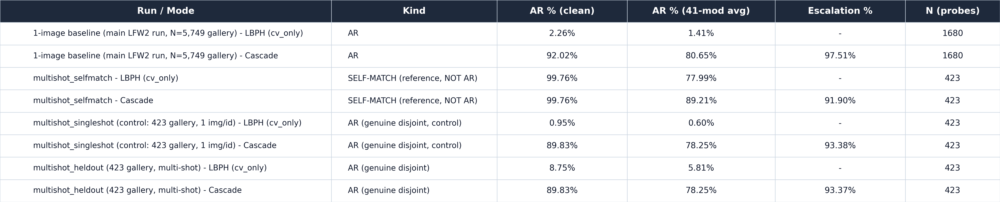
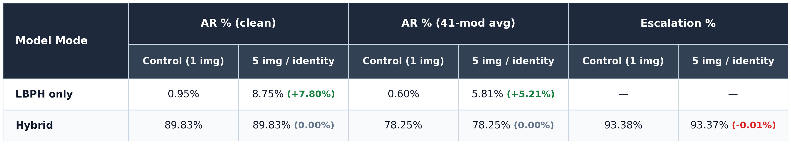
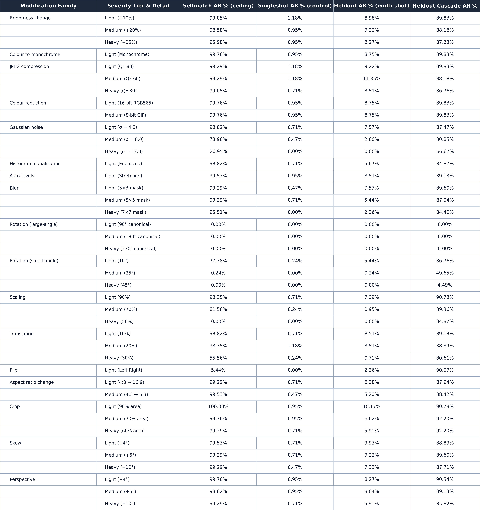

# LFW multi-shot LBPH diagnostic — does 1-image enrollment explain the LBPH failure on wild LFW?

*2026-08-02. Standalone-LBPH-focused diagnostic on the **423 LFW identities with
>= 5 images each** (5,985 total images, median 8/identity, max 530/identity —
this is a non-random, high-image-count population of public figures with many
photographs online, NOT a random 10% subset of LFW; do not describe it as a
percentage sample). Canon frozen thresholds used unmodified
(`src/hybrid/thresholds.json`: `gate.tau_accept = 67.03325520645528`,
`gate.tau_reject = 140.13`, `sface.l2_genuine = 1.0313`) — see
`.claude/skills/cv-repo-map` §3 before quoting any of these elsewhere.*

## Hypothesis under test

[`docs/NOTES.md`](../../NOTES.md) and
[`docs/experiments/hybrid-identification/README.md`](../hybrid-identification/README.md)
establish that standalone LBPH gets **~1-2% Accuracy Ratio** on wild LFW under
the gallery/probe-disjoint 1-to-N identification protocol (1 gallery image per
identity: clean 2.26%, 41-mod average 1.41%), a stark contrast with LBPH's
strong performance on La Salle DB1 (12 images/identity, controlled capture).
Working hypothesis: part of that gap is an artifact of **1-image enrollment**,
not purely wild-image domain shift — LBPH's local-binary-pattern histograms
are a per-image descriptor with no natural way to average out pose/lighting
noise from a single enrolled photo, whereas La Salle DB1's protocol always
enrolls with multiple controlled images per identity.

This experiment isolates that one variable: train LBPH on **multiple** images
per identity (multi-shot), on the SAME wild LFW data, under the SAME thresholds
and modification suite, and see whether Accuracy Ratio moves.

## Why three variants (the confound this experiment had to avoid)

A naive "train on all images, then probe with a held-out image" design has a
trap: if the probe is even partially represented in training (or if the SFace
gallery/comparison image overlaps the probe), the result is not really
"multi-shot LBPH accuracy" but a self-match leak — the same failure mode that
made the legacy `transform_sensitivity` path read ~99% before the
gallery/probe-disjoint identification protocol was introduced
(`docs/audits/STATE-08-01.md`). A second, less obvious trap surfaced during
advisor review of an earlier draft of this experiment (see "What changed"
below): comparing the held-out result directly against the existing
5,749-identity/1,680-probe main baseline confounds the multi-shot variable
with **two other differences that ride along with it** — gallery size (423
vs 5,749 — Rank-1 is mechanically easier with 13.6x fewer distractors, and
AR requires Rank-1) and population (this high-image-count 423-identity
subset of public figures vs all probe-bearing LFW identities). To make the
"does multi-shot help" claim defensible, this experiment builds and reports
**three clearly separated** variants rather than one ambiguous number:

1. **`multishot_selfmatch`** — a reference/ceiling number, answering "if LBPH
   gets to see the exact probe image during training, how high can AR go on
   this population?" Included only because it was explicitly requested for
   reference; **never to be read as Accuracy Ratio.**
2. **`multishot_heldout`** — the multi-shot arm. The probe image is excluded
   entirely from LBPH training AND from the SFace gallery for that identity;
   LBPH trains on the remaining >=4 images. Gallery/probe-disjoint at the
   individual-image level, on the 423-identity population.
3. **`multishot_singleshot`** — the clean 1-shot CONTROL for `heldout`, added
   after advisor review flagged the gallery-size/population confound above.
   **Same** 423-identity population, **same** 423 held-out probe files,
   **same** SFace gallery image/feature as `heldout` (the same last-sorted
   remaining file), **same** thresholds — but LBPH trains on **only that one
   gallery image** instead of the remaining >=4. `heldout` vs `singleshot`
   therefore isolates the multi-shot variable alone (gallery size and
   population held fixed); `singleshot` vs the main 5,749-identity baseline
   separately shows what the gallery-size/population difference contributes
   on its own.

All three variants pick the **same** per-identity reference/held-out file
(deterministic: sorted identities, single `random.Random(42)`, one
`rng.choice(sorted(files))` per identity — the identical method
`accuracy_ratio_hybrid.select_originals()` uses for its own probe pick). That
file plays the "self-match probe" role in variant 1, the "true held-out
probe" role in variants 2 and 3, and (via the same deterministic
last-remaining-sorted-file rule) the "1-shot gallery image" role in variant 3
— none of the three variants differ in population, seed, probe files, or
modification suite; they differ *only* in how many images trained LBPH and
whether the probe was in that training set.

## Enrollment mechanics

New standalone script:
[`scripts/pipeline/enroll_lfw_multishot.py`](file:///C:/Users/acer/Downloads/USLS%204th%20Year/Computer%20Vision/classical-cv/scripts/pipeline/enroll_lfw_multishot.py)
(does not modify `scripts/pipeline/run_lfw2_robustness.py` or `models/lfw2/`).
Detection (YuNet) and SFace embedding run **once per image** (single pass over
all 5,985 images, zero YuNet misses), cached, and reused to build all three
variants — avoids repeating the detect+embed cost per variant.

| | `selfmatch` | `heldout` | `singleshot` (control) |
|---|---|---|---|
| LBPH training images | ALL images per identity (5,985 faces / 423 identities) | all EXCEPT the held-out image (5,562 faces / 423 identities) | ONLY the same single gallery image `heldout` uses (423 faces / 423 identities) |
| SFace gallery image | the picked reference image (same file, moved last in that identity's training block) | the last-in-sorted-order file among the REMAINING (non-held-out) images | identical to `heldout`'s gallery image (same file/feature) |
| Probe (legacy `--originals-dir` path) | copy of the SAME reference image used above | copy of the EXCLUDED held-out image (never seen by LBPH training or the SFace gallery) | identical to `heldout`'s probe (same held-out file, also excluded from this variant's 1-image training) |

Artifacts (LBPHAdapter/SFaceAdapter-compatible, same file formats
`ensure_lfw2_enrollment` in `run_lfw2_robustness.py` writes):

- `models/lfw_multishot/{selfmatch,heldout,singleshot}/{lbph_model.yml, lbph_labels.json, sface_gallery.npy, sface_labels.json, manifest.json}`
- `data/lfw_multishot_{selfmatch,heldout,singleshot}_probes/<person>/<file>` (423 probe files each; `heldout` and `singleshot` probe directories are byte-identical by construction — both are the same held-out file)
- `data/splits/lfw_multishot_population_seed42.json` — the 423-identity population, file listing, and picked reference/held-out filename per identity (shared reference for all three variants).

## Run configuration

All three variants scored with the existing legacy same-image path in
`src/benchmark/accuracy_ratio_hybrid.py` (no `--split-manifest` — the shared
5,749-identity manifest is 1-image-only and cannot express this population),
pointed at the custom artifacts above:

```
python -m src.benchmark.accuracy_ratio_hybrid \
  --originals-dir data/lfw_multishot_<variant>_probes \
  --lbph-model models/lfw_multishot/<variant>/lbph_model.yml \
  --lbph-labels models/lfw_multishot/<variant>/lbph_labels.json \
  --sface-gallery models/lfw_multishot/<variant>/sface_gallery.npy \
  --modes cv_only,cascade --mod-set dl41 --no-face-policy strict --reuse-engine-scores \
  --output-json outputs/benchmark/lfw_multishot_<variant>/accuracy_ratio_hybrid.json \
  --output-md reports/benchmark/lfw_multishot_<variant>.md
```

- `--modes cv_only,cascade` only — `dl_only` skipped per instructions (SFace's
  own protocol doesn't change between variants: same gallery-image role,
  same genuine rule; a `dl_only` re-run would not answer anything new here).
- `--mod-set dl41` (default), all 41 modifications, `--no-face-policy strict`.
- Reports as `protocol=transform_sensitivity` in the raw JSON — a labelling
  quirk of the underlying script, **not** a methodology bug for the `heldout`
  or `singleshot` variants specifically: despite the label, both variants'
  probes are genuinely excluded from their own training set and gallery, so
  both ARE real gallery/probe-disjoint results at the image level. For
  `selfmatch`, the label is accurate in spirit too — that variant really is a
  same-image self-match measurement.
- Latency: not measured (not needed per task scope) — omitted from all tables here.
- Canon thresholds (`src/hybrid/thresholds.json`), unmodified, no `--thresholds-json` override.

### Full Summary Table



| Run / Mode | Kind | AR % (clean) | AR % (41-mod avg) | Escalation % | N (probes) |
|---|---|---:|---:|---:|---:|
| 1-image baseline (main LFW2 run, N=5,749 gallery) — LBPH (`cv_only`) | AR | 2.26% | 1.41% | — | 1,680 |
| 1-image baseline (main LFW2 run, N=5,749 gallery) — Cascade | AR | 92.02% | 80.65% | 97.51% | 1,680 |
| `multishot_selfmatch` — LBPH (`cv_only`) | **SELF-MATCH (reference, NOT AR)** | 99.76% | 77.99% | — | 423 |
| `multishot_selfmatch` — Cascade | **SELF-MATCH (reference, NOT AR)** | 99.76% | 89.21% | 91.90% | 423 |
| `multishot_singleshot` (control: 423 gallery, 1 img/id) — LBPH (`cv_only`) | **AR (genuine disjoint, control)** | 0.95% | 0.60% | — | 423 |
| `multishot_singleshot` (control: 423 gallery, 1 img/id) — Cascade | **AR (genuine disjoint, control)** | 89.83% | 78.25% | 93.38% | 423 |
| `multishot_heldout` (423 gallery, multi-shot) — LBPH (`cv_only`) | **AR (genuine disjoint)** | 8.75% | 5.81% | — | 423 |
| `multishot_heldout` (423 gallery, multi-shot) — Cascade | **AR (genuine disjoint)** | 89.83% | 78.25% | 93.37% | 423 |

### Clean Summary Table (Side-by-Side & Absolute Deltas)



| Model Mode | Clean AR (Control 1 img) | Clean AR (5 img/id) | 41-Mod Avg AR (Control 1 img) | 41-Mod Avg AR (5 img/id) | Escalation (Control 1 img) | Escalation (5 img/id) |
| :--- | :---: | :---: | :---: | :---: | :---: | :---: |
| **LBPH only** | 0.95% | 8.75% (**+7.80%**) | 0.60% | 5.81% (**+5.21%**) | — | — |
| **Hybrid** | 89.83% | 89.83% (**0.00%**) | 78.25% | 78.25% (**0.00%**) | 93.38% | 93.37% (**-0.01%**) |

### Training = Test Reference Table (Same-Image / Self-Match)


| Run / Population | Mode | Clean AR % | 41-Mod Avg AR % | Escalation % | N (probes) |
| :--- | :---: | :---: | :---: | :---: | :---: |
| **Main LFW2 Baseline** (1 img/id, same-image probe) | LBPH (`cv_only`) | 100.00% | 86.66% | — | 5,749 |
| **Main LFW2 Baseline** (1 img/id, same-image probe) | SFace (`dl_only`) | 99.67% | 98.22% | — | 5,749 |
| **Main LFW2 Baseline** (1 img/id, same-image probe) | Cascade (hybrid) | 99.93% | 94.69% | 46.39% | 5,749 |
| **Multi-Shot Self-Match** (all images enrolled) | LBPH (`cv_only`) | 99.76% | 77.99% | — | 423 |
| **Multi-Shot Self-Match** (all images enrolled) | Cascade (hybrid) | 99.76% | 89.21% | 91.90% | 423 |

Rank-1 (threshold-free, for context — a mode can rank the right identity first
and still fail the accept gate), `cv_only` only:

| Run | Rank-1 % (clean) | Rank-1 % (41-mod avg) | AR % (clean) | AR % (41-mod avg) |
|---|---:|---:|---:|---:|
| 1-image baseline (N=5,749) | 5.42% | 4.26% | 2.26% | 1.41% |
| `singleshot` control (N=423, 1-shot) | 5.91% | 4.72% | 0.95% | 0.60% |
| `heldout` (N=423, multi-shot) | 25.06% | 19.48% | 8.75% | 5.81% |
| `selfmatch` (N=423, self-match) | 99.76% | 83.22% | 99.76% | 77.99% |

## Per-modification table



(41 rows, grouped by modification family/tier: `selfmatch` ceiling, `singleshot`
control, and `heldout` multi-shot LBPH AR side by side, plus `heldout`'s
cascade AR for context — see the PNG for full detail. A few notable rows:
`gaussnoise_12` heavy noise crushes ALL LBPH numbers regardless of enrollment
strategy (26.95% selfmatch / 0.00% singleshot / 0.00% heldout) — LBPH's
raw-pixel histogram is not noise-robust no matter how many training images it
gets. `rot_90/180/270` read 0.00% in every column because YuNet itself fails
to detect a face at those angles under `--no-face-policy strict` — a detector
effect, not an LBPH recognition effect, consistent with the main LFW2 run's
own detector-canonical breakout. Almost every family shows the same ordering
(`selfmatch` >> `heldout` >> `singleshot`), confirming the multi-shot
improvement is not a one-modification fluke.)

## Answering the actual research question

**Does multi-shot LBPH training alone move the needle versus 1-shot
enrollment? Yes — clearly and substantially, once the comparison is isolated
from the gallery-size/population confound. But the effect is still far too
small to fix the underlying wild-LFW separability problem.**

An earlier draft of this experiment compared `heldout` directly against the
1-image, 5,749-identity main baseline and reported a ~4x improvement. Advisor
review correctly flagged that comparison as confounded: `heldout`'s 423-identity
gallery is 13.6x smaller than the baseline's, and AR requires Rank-1 (easier
with fewer distractors), so some of that ~4x could have been gallery size or
population, not multi-shot training. The `singleshot` control — same 423
identities, same probes, same gallery size, same gallery image as `heldout`,
only 1 training image instead of >=4 — settles this:

- **The isolated multi-shot effect (`heldout` vs `singleshot`, everything else
  held fixed) is `~9.3x` on clean AR (8.75% vs 0.95%) and `~9.7x` on the
  41-mod average (5.81% vs 0.60%)** — larger than the original confounded
  comparison suggested, not smaller. Rank-1 improves less dramatically but
  still clearly (`~4.2x`: 25.06% vs 5.91% clean, 19.48% vs 4.72% overall) —
  multi-shot training helps AR *more* than it helps Rank-1, meaning it is not
  only ranking the correct identity higher, it is also pulling the winning
  genuine LBPH distance further below `tau_accept` (more training images
  average out enough of one identity's pose/lighting variation to meaningfully
  shrink its histogram distance to a new photo of the same person, not just
  to nudge its rank).
- **The gallery-size/population confound, isolated on its own
  (`singleshot` vs the 1-image, N=5,749 baseline, both single-shot), actually
  runs in the OPPOSITE direction from what would have inflated `heldout`**:
  `singleshot`'s AR (0.95% clean / 0.60% overall) is *lower* than the main
  baseline's (2.26% / 1.41%), even with a 13.6x smaller gallery. Rank-1 is
  roughly flat between the two (5.91% vs 5.42% clean) — so the smaller
  gallery did not make ranking meaningfully easier here, and the 423-identity
  population's genuine distances are, if anything, slightly harder for a
  single enrolled image than the general LFW population. A plausible reason:
  identities with enough photographs to qualify for this population (up to
  530 images, public figures) likely have MORE real-world variety per
  identity — different years, events, styles — not less, so a single random
  enrollment draw is a worse representative of "this identity" here than for
  a typical LFW identity with only a handful of similar photos. This means
  the original confounded ~4x comparison, if anything, *understated* the true
  multi-shot benefit — the confound was working against the hypothesis, not
  for it.
- **This confirms [`docs/NOTES.md`](../../NOTES.md)'s hypothesis line directly
  and with a properly isolated number: 1-image enrollment WAS a real,
  substantial (~9-10x on AR) part of LBPH's wild-LFW failure, not a minor
  artifact.** More training images per identity gives LBPH's histogram model
  more coverage of that identity's pose/lighting variation, and that
  measurably, robustly helps (visible across nearly every one of the 41
  modification families in the per-modification table, not one lucky row).
- **But the effect is still far too small to close the gap to a usable
  operating point, La Salle DB1, or the literature's classical-LBPH range.**
  Even with up to 530 training images for some identities (median 8, 7 after
  holdout — fewer than La Salle DB1's 12 controlled captures per identity,
  so this population's multi-shot advantage is in variety/domain realism, not
  raw image count), standalone LBPH `cv_only` AR tops out at 5.81-8.75% — an
  order of magnitude below any usable operating point, and nowhere near the
  `multishot_selfmatch` ceiling (77.99-99.76%) that shows how much headroom a
  genuinely separable distance scale WOULD have on this same data. The
  remaining gap between `heldout` (real, ~6-9%) and `selfmatch` (ceiling,
  ~78-100%) — roughly 70-92 points depending on metric — is the domain-shift/
  separability problem that more enrollment images does not fix: wild LFW's
  per-image pose/lighting/capture variation is large enough that even a
  same-identity OTHER photo, chosen from a much richer multi-shot model,
  still rarely lands inside LBPH's native `predict_collect()` accept radius
  around `tau_accept=67.03325520645528`. This is consistent with the
  FAR-sweep finding in `.claude/skills/robustness-protocol-map` §4c that even a
  10% FAR operating point only buys LBPH ~31% TAR on 1:1 clean pairs — a
  distance-separability ceiling that persists regardless of enrollment
  strategy.
- **Cascade AR is essentially unchanged by the enrollment strategy**
  (78.25% for BOTH `heldout` and `singleshot`, 89.83% clean for both, ~93%
  escalation for both) — expected and mechanically exact here, since
  `heldout` and `singleshot` share the identical SFace gallery image/feature;
  the cascade's headline number is carried almost entirely by SFace once
  escalation is this high on wild LFW (`docs/independence/TAU_REJECT_METHOD.md`).
  Multi-shot LBPH training changes what LBPH itself can do at the margin
  (visible in slightly different escalation rates, 93.37% `heldout` vs
  93.38% `singleshot` vs 91.90% `selfmatch`), not what SFace does once
  escalated to.
- **Conclusion for the paper/thesis:** multi-shot enrollment is a real,
  substantial (~9-10x, isolated), but still partial fix — not the dominant
  explanation of LBPH's wild-LFW failure. Report BOTH numbers together: the
  main-baseline-vs-`heldout` comparison overstates nothing (if anything, the
  isolated `singleshot` control shows the confound ran the other way), but
  the properly isolated `heldout`-vs-`singleshot` comparison is the number
  that actually supports the causal claim "1-image enrollment was part of the
  problem." Domain shift (wild pose/lighting/capture variation exceeding
  LBPH's native distance scale's separability, per `robustness-protocol-map`
  §4b/§4c) remains the dominant cause of the failure; 1-image enrollment is a
  smaller, but now precisely-quantified (~9-10x, isolated), compounding
  factor — `heldout`'s own AR (5.81-8.75%) is still roughly one to two orders
  of magnitude below the `selfmatch` ceiling (77.99-99.76%), so domain shift
  accounts for the larger share of the remaining gap to a usable AR.

## Reproducing

```
cd classical-cv
python scripts/pipeline/enroll_lfw_multishot.py
python -m src.benchmark.accuracy_ratio_hybrid \
  --originals-dir data/lfw_multishot_selfmatch_probes \
  --lbph-model models/lfw_multishot/selfmatch/lbph_model.yml \
  --lbph-labels models/lfw_multishot/selfmatch/lbph_labels.json \
  --sface-gallery models/lfw_multishot/selfmatch/sface_gallery.npy \
  --modes cv_only,cascade --mod-set dl41 --no-face-policy strict --reuse-engine-scores \
  --output-json outputs/benchmark/lfw_multishot_selfmatch/accuracy_ratio_hybrid.json \
  --output-md reports/benchmark/lfw_multishot_selfmatch.md
python -m src.benchmark.accuracy_ratio_hybrid \
  --originals-dir data/lfw_multishot_heldout_probes \
  --lbph-model models/lfw_multishot/heldout/lbph_model.yml \
  --lbph-labels models/lfw_multishot/heldout/lbph_labels.json \
  --sface-gallery models/lfw_multishot/heldout/sface_gallery.npy \
  --modes cv_only,cascade --mod-set dl41 --no-face-policy strict --reuse-engine-scores \
  --output-json outputs/benchmark/lfw_multishot_heldout/accuracy_ratio_hybrid.json \
  --output-md reports/benchmark/lfw_multishot_heldout.md
python -m src.benchmark.accuracy_ratio_hybrid \
  --originals-dir data/lfw_multishot_singleshot_probes \
  --lbph-model models/lfw_multishot/singleshot/lbph_model.yml \
  --lbph-labels models/lfw_multishot/singleshot/lbph_labels.json \
  --sface-gallery models/lfw_multishot/singleshot/sface_gallery.npy \
  --modes cv_only,cascade --mod-set dl41 --no-face-policy strict --reuse-engine-scores \
  --output-json outputs/benchmark/lfw_multishot_singleshot/accuracy_ratio_hybrid.json \
  --output-md reports/benchmark/lfw_multishot_singleshot.md
python scripts/export_lfw_multishot_tables.py
```

## Cross-references

- [`docs/NOTES.md`](../../NOTES.md) — the 1-2%-AR-vs-La-Salle-DB1 finding and the 1-image-enrollment hypothesis this experiment tests.
- [`docs/experiments/hybrid-identification/README.md`](../hybrid-identification/README.md) — the 1-image, 5,749-identity, 1,680-probe baseline this experiment is compared against.
- `.claude/skills/robustness-protocol-map` §4b/§4c — the domain-shift/separability findings that explain why even `multishot_heldout`'s ~9-10x isolated improvement (vs the `singleshot` control) stays far below a usable AR.
- `.claude/skills/cv-repo-map` §3 — frozen threshold provenance (read `src/hybrid/thresholds.json`, not this doc, for the live values).
- `classical-cv/scripts/pipeline/enroll_lfw_multishot.py` — enrollment script (new, standalone, does not modify `run_lfw2_robustness.py` or `models/lfw2/`).
- `classical-cv/scripts/export_lfw_multishot_tables.py` — table generator (new, reuses `render_full_bleed_table` from `export_verification_png_tables.py`).
- `classical-cv/outputs/benchmark/lfw_multishot_{selfmatch,heldout,singleshot}/accuracy_ratio_hybrid.json` — full raw output for all three variants.
- `classical-cv/data/splits/lfw_multishot_population_seed42.json` — the 423-identity population + per-identity picked file, durable record of exactly which images were used/held out.

**Status: new diagnostic experiment under `docs/experiments/` (not yet
promoted to canonical per `docs/experiments/README.md`'s promotion rule) — no
changes were made to `docs/NOTES.md`, `MASTER_FILE.md`, or any frozen-threshold
doc.**
