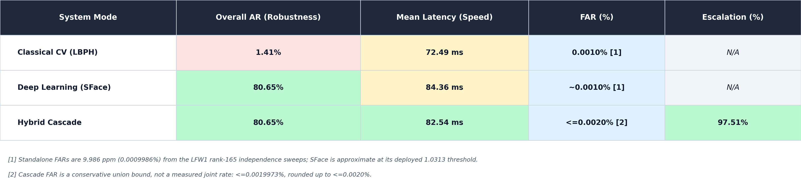

# LFW2 Robustness Summary Table Reference

| System mode | Overall AR (robustness) | Mean latency (isolated) | FAR (%) | Escalation (%) |
|---|---:|---:|---:|---|
| Classical CV (LBPH) | 1.41% | 72.49 ms | 0.0010% [1] | N/A |
| Deep Learning (SFace) | 80.65% | 84.36 ms | ~0.0010% [1] | N/A |
| Hybrid Cascade | 80.65% | 82.54 ms | <=0.0020% [2] | 97.51% |

[1] The standalone LFW1 independence sweeps each realize 9.986 ppm FAR
(0.0009986%; displayed as 0.0010%) at rank 165 of 16,522,626 unique
impostor pairs. SFace uses the deployed 1.0313 boundary rather than the
standalone 1.0306278 sweep boundary; the recorded 0.0007 gap is resolved as
immaterial, so its cell is marked approximate.

[2] The current cascade has no directly measured joint FAR on the same
LFW1 sweep. Its value is therefore the conservative union bound
`FAR_LBPH + FAR_SFace <= 0.0019973%`, rounded up to <=0.0020%, not a measured
cascade rate. A joint rerun is required for an exact cascade FAR.

## Scope and provenance

- Protocol: gallery/probe-disjoint LFW2 1-to-N identification; 5,749 enrolled
  identities, 1,680 probes, all 41 modifications, strict no-face handling.
- AR: mean fixed-threshold acceptance ratio over the 41 modifications.
- Latency: isolated single-process mean from the separate 575-identity
  (172-clean-probe) timing run; it is not the cache-assisted latency reported
  by the parallel AR run.
- Escalation: only applies to the hybrid cascade; it is the mean across the
  41 modifications. It is not applicable to either standalone mode.
- Source: `ROBUSTNESS_RESULT_PROVENANCE.md` in this directory. The table
  intentionally omits clean acceptance and the parallel ensemble.
